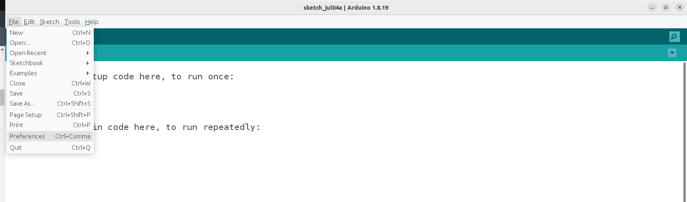
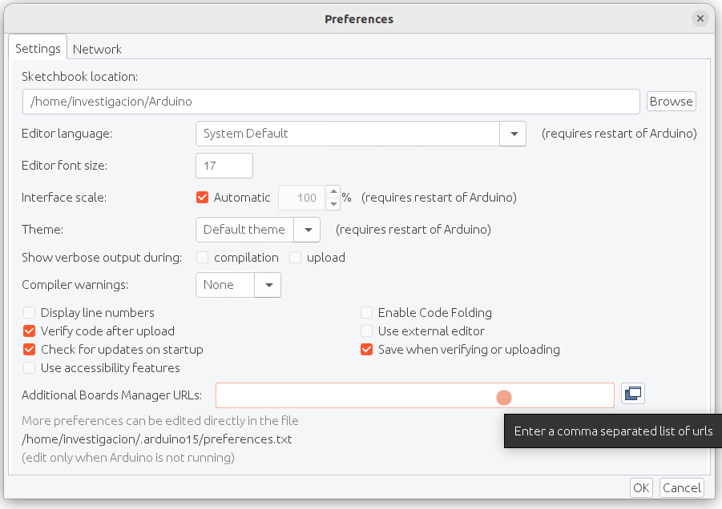
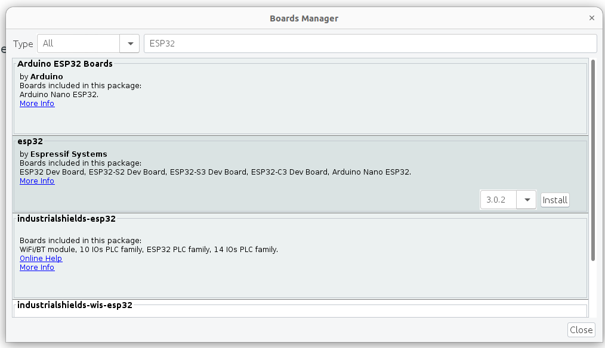
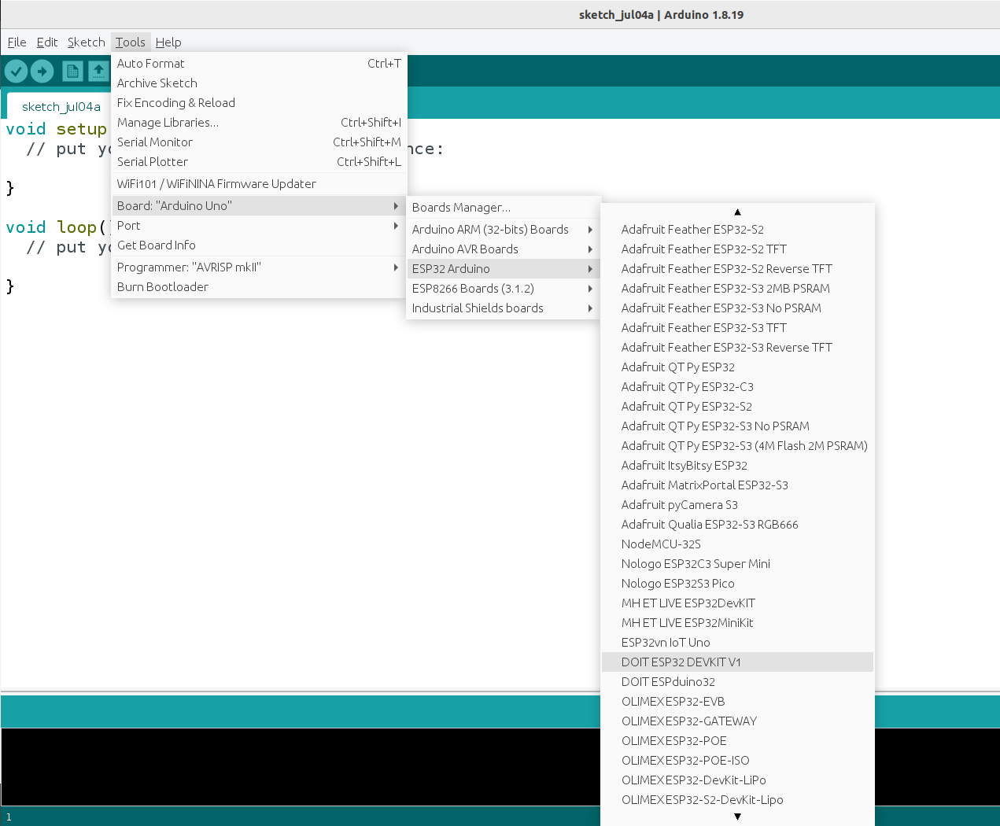
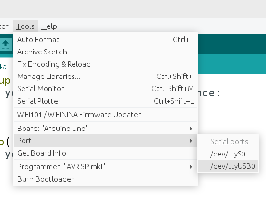

# ANEXO 0 - Tareas periódicas en una ESP32 usando FREERTOS

Para programar la tarjeta ESP32 se emplea como entorno el IDE de Arduino, en esta guía se emplea la versión 1.8.19, se parte del hecho de que este software ya está instalado en el PC que será empleado para programar la tarjeta. La ESP32 no viene incluida por defecto en el IDE de arduino, pero se puede agregar mediante el “Gestor de tarjetas”.

## Paso 1 - Agregar compatibilidad con tarjetas ESP32

1) Abrir el IDE de Arduino, ingresar en la barra de opciones superior a “Archivo/File” > “Preferencias/Preferences”.
   

    
2) En el campo “URLs adicionales de gestor de tarjetas/Additional Boards Manager URLs”, añade la siguiente URL:
```
https://espressif.github.io/arduino-esp32/package_esp32_index.json
```


3) Tras guardar los cambios y cerrar la ventana, ingrese en el menú de opciones superior a “Herramientas/Tools” > “Placa/Board” > “Gestor de tarjetas/Boards Manager”.


4) En la ventana que aparece, empleando la barra de búsqueda se ingresa “ESP32” y al aparecer los resultados se identifica el que tiene como título "esp32" y en la descripción "by Espressif Systems". Posteriormente se da clic en el botón "Instalar/Install".



## Paso 2 - Seleccionar la tarjeta ESP32 y el puerto

Tras haber instalado las herramientas de compatibilidad con las tarjetas ESP32 y haber conectado la tarjeta al PC mediante cable USB. Se realiza el siguiente procedimiento: 

1) Se debe ingresar a la opción “Herramientas/Tools” > “Placa/Board” > "ESP32 Arduino" y seleccionar del la referencia de la respectiva placa a programar. En nuestro caso se debe seleccionar la opción "DOIT ESP32 DEVKIT V1".



2) Finalmente debe de seleccionar el puerto de comunicación serial al cual está conectado la tarjeta, mediante el menú  “Herramientas/Tools” > “Puerto/Port”. En caso de estar desde un sistema operativo Windows, los nombres de los puertos siguen la estructura "COMX", mientras que en sistemas operativos Linux tienen la estructura "/dev/USBX".



## Paso 3 - Librerías requeridas

FREERTOS está incorporado de fábrica en los microcontroladores ESP32, ya que estas tarjetas usan este sistema operativo para gestionar las tareas básicas del microcontrolador, con lo cual se puede utilizar sin necesidad de añadir cabeceras ni librerías adicionales para usarlo.

## Paso 4 -  Programación de tareas con FREERTOS

En general, existen dos bloques de código necesarios para la programación de tareas en FREERTOS: el bloque de [**creación de la tarea**](#creación-de-la-tarea) y la **función que ejecuta la tarea**. En este caso se va a crear una tarea que va a ejecutar una función de forma periódica.

### Creación de la tarea

Existen dos funciones de FREERTOS para crear tareas, estas son **"xTaskCreate"** y **"xTaskCreatePinnedToCore"**. Ambas funciones permiten crear tareas pero su diferencia es que **"xTaskCreate"** deja que el sistema operativo seleccione líbremente el núcleo al cual asignar la tarea, mientras que con **"xTaskCreatePinnedToCore"** mediante un parámetro se especifica a cual nucleo se le asignará la tarea para su ejecución. 

Se debe tener precaución al crear y asignar tareas manualmente, pues el ESP32 utiliza el núcleo 0 para ciertas tareas criticas (WiFi, bluetooth, entre otras), con lo cual, asignar otras tareas de alta prioridad y con un tiempo de ejecución alto a este núcleo puede dar lugar a que el microcontrolador se reinicie si se interrumpen o que no se ejecuten a tiempo. Es por ello que se recomienda asignar ese tipo de tareas al núcleo 1. 

Sin importar la función a emplear para crear la tarea, el bloque de código que corresponde a su llamado ha de disponerse al interior de la función "void setup()". En este ejemplo se creará una tarea usando "xTaskCreatePinnedToCore", la cual va a ejecutar una función que será nombrada "Blink", dicha función cambiará periodicamente el estado de una salida digital de la ESP32 a la cual está conectado un LED, consiguiendo con ello que el parpadeo del LED. A continuación se muestra el código correspondiente:

```C

void setup() {
  xTaskCreatePinnedToCore(
    Blink, // Nombre de la función
    "Task1", // Nombre de la tarea
    1024, // Tamaño de la pila
    NULL, // pvParameters
    0, // Prioridad
    NULL, // Task handler
    1 // Nucleo
  );
}
```
Como se puede observar, el llamado a esta función requiere de varios parámetros, los cuales se detallan a continuación:

- **Nombre de la función:** Corresponde al nombre que tendrá la función que será ejecutada por la tarea. 
- **Nombre de la tarea:** Corresponde al un nombre de referencia para la tarea. Este nombre se emplea principalmente para tareas de depuración, mientras que para la mayoria de operaciones que se pueden realizar sobre la tarea (suspender, reanudar, eliminar, etc.) se emplea el Task handler, un parámetro que se detallará mas adelante. La longitud máxima por defecto para el nombre de la tarea es de 13 caracteres.
- **Tamaño de pila**: Se refiere a la cantidad de memoria reservada para la pila de un hilo o tarea. La pila es una estructura de datos en memoria utilizada por las tareas para almacenar variables locales, direcciones de retorno y otros datos temporales necesarios durante la ejecución de la tarea. El tamaño de la pila se especifica en palabras (words), no en bytes. Esto significa que el tamaño de la pila depende del tamaño de la palabra del microcontrolador o procesador que se esté utilizando. Por ejemplo, en un sistema con una arquitectura de 32 bits, una palabra tiene 4 bytes, por lo que un tamaño de pila de 1024 palabras correspondería a 4096 bytes de memoria.
- **Argumentos a pasar a la función:** A este parámetro se le debe asignar un puntero a través del cual es posible pasar argumentos para la función que ejecutará la tarea. Si el puntero corresponde a una estructura de datos, es posible pasar múltiples argumentos a la función, como se muestra en este ejemplo. Tambíen es posible asignar a este parámetro el valor "NULL", en caso que no se requiera pasar argumentos a la función. 
- **Prioridad:** Debe ser un número entero dentro del rango de prioridades que se configura mediante el parámetro de FREERTOS "configMAX_PRIORITIES", siendo 0 la menor prioridad y configMAX_PRIORITIES – 1 la máxima. Por defecto "configMAX_PRIORITIES" tiene un valor de cuatro, en consecuencia el rango de prioridades es de 0 a 3. Según el tipo de aplicación puede llegar a ser conveniente incrementar la cantidad de niveles de prioridad. Este valor determina el orden en el que deben ser atendidas las tareas que están listas para ejecución, siendo las de prioridad mas alta ejecutadas primero.
- **Task Handler:** A este parámetro se le debe asignar el puntero de una variable de tipo "TaskHandle_t" (dirección de memoria de dicha variable, por lo que hay que incluir el carácter ampersand "&" antes del nombre de la variable). Dicha variable se utiliza para referenciar desde otras partes del programa una tarea específica después de haber sido creada, permitiendo realizar acciones de control (se puede suspender, reanudar, eliminar, o cambiar la prioridad de una tarea específica utilizando su manejador), sincronización (por ejemplo, bloquear una tarea hasta que otra haya completado su trabajo) y consultar el estado de la tarea. Si no existe la necesidad de realizar ningún tipo de acción sobre la tarea, a este parámetro se le puede asignar el valor "NULL" como es el caso de este ejemplo.
- **Nucleo:** Debe ser un número entero mediante el cual se especifica en núcleo al que se le asignará la ejecución de la tarea. En el caso del ESP32, al contar con dos núcleos, este valor puede ser 0 o 1. Como se ha mencionado con anterioridad, se debe tener precaución al momento de asignar ciertas tareas al núcleo 0. 


