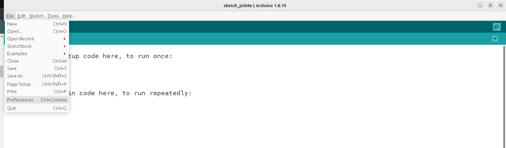
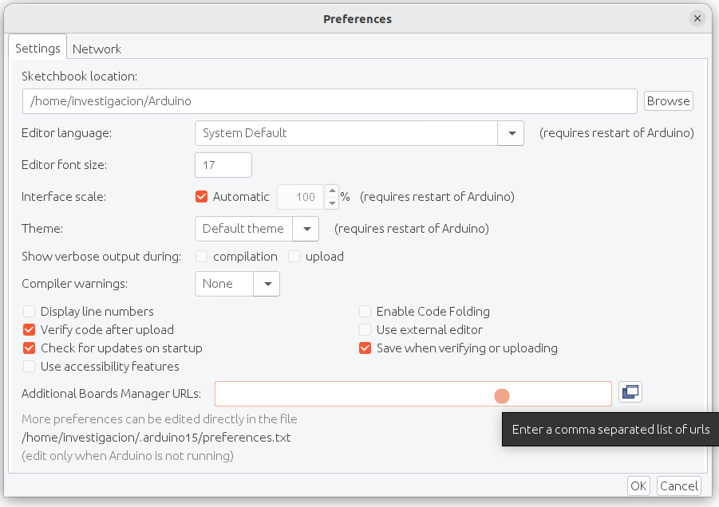
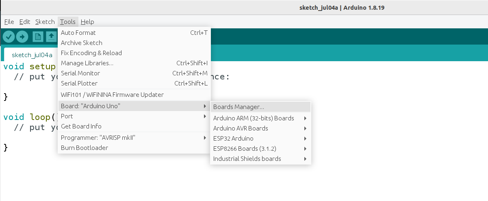
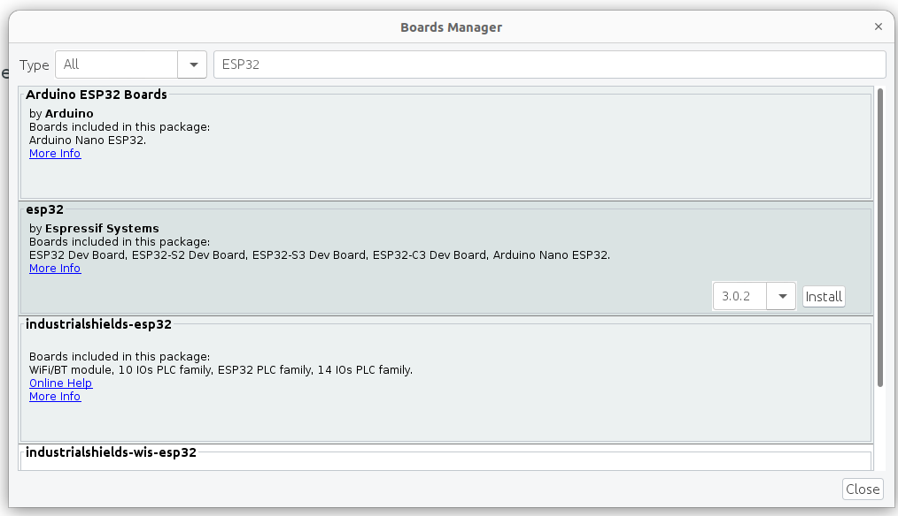
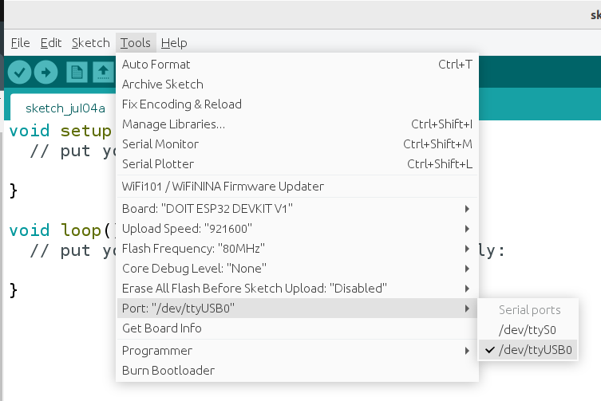

# ANEXO 1 - Programación de tareas de tiempo real en ESP32 usando FREERTOS 

Para programar la tarjeta ESP32 se emplea como entorno el IDE de Arduino, en esta guía se emplea la versión 1.8.19, se parte del hecho de que este software ya está instalado en el PC que será empleado para programar la tarjeta. La ESP32 no viene incluida por defecto en el IDE de arduino, pero se puede agregar mediante el “Gestor de tarjetas”.

# 1.1 - Instalación

## Paso 1 - Agregar compatibilidad con tarjetas ESP32

1) Abrir el IDE de Arduino, ingresar en la barra de opciones superior a “Archivo/File” > “Preferencias/Preferences”.
   

    
2) En el campo “URLs adicionales de gestor de tarjetas/Additional Boards Manager URLs”, añade la siguiente URL:
```
https://espressif.github.io/arduino-esp32/package_esp32_index.json
```


3) Tras guardar los cambios y cerrar la ventana, ingrese en el menú de opciones superior a “Herramientas/Tools” > “Placa/Board” > “Gestor de tarjetas/Boards Manager”.



4) En la ventana que aparece, empleando la barra de búsqueda se ingresa “ESP32” y al aparecer los resultados se identifica el que tiene como título "esp32" y en la descripción "by Espressif Systems". Posteriormente se da clic en el botón "Instalar/Install".



## Paso 2 - Seleccionar la tarjeta ESP32 y el puerto

Tras haber instalado las herramientas de compatibilidad con las tarjetas ESP32 y haber conectado la tarjeta al PC mediante cable USB. Se realiza el siguiente procedimiento: 

1) Se debe ingresar a la opción “Herramientas/Tools” > “Placa/Board” > "ESP32 Arduino" y seleccionar del la referencia de la respectiva placa a programar. En nuestro caso se debe seleccionar la opción "DOIT ESP32 DEVKIT V1".


2) Finalmente debe de seleccionar el puerto de comunicación serial al cual está conectado la tarjeta, mediante el menú  “Herramientas/Tools” > “Puerto/Port”. En caso de estar desde un sistema operativo Windows, los nombres de los puertos siguen la estructura "COMX", mientras que en sistemas operativos Linux tienen la estructura "/dev/USBX".



## Paso 3 - Librerías requeridas

FREERTOS está incorporado de fábrica en los microcontroladores ESP32, ya que estas tarjetas usan este sistema operativo para gestionar las tareas básicas del microcontrolador, con lo cual se puede utilizar sin necesidad de añadir cabeceras ni librerías adicionales para usarlo.

# 1.2 - Programación de tareas con FREERTOS

En general, existen dos bloques de código necesarios para la programación de tareas en FREERTOS: el bloque de [**creación de la tarea**](#creación-de-la-tarea) y la [**función que ejecuta la tarea**](#definición-de-la-función-ejecutada-en-la-tarea). En este caso se va a crear una tarea que va a ejecutar una función de forma periódica.

## Creación de la tarea

Existen dos funciones de FREERTOS para crear tareas, estas son **"xTaskCreate"** y **"xTaskCreatePinnedToCore"**. Ambas funciones permiten crear tareas pero su diferencia es que **"xTaskCreate"** deja que el sistema operativo seleccione líbremente el núcleo al cual asignar la tarea, mientras que con **"xTaskCreatePinnedToCore"** mediante un parámetro se especifica a cual nucleo se le asignará la tarea para su ejecución. 

Se debe tener precaución al crear y asignar tareas manualmente, pues el ESP32 utiliza el núcleo 0 para ciertas tareas criticas (WiFi, bluetooth, entre otras), con lo cual, asignar otras tareas de alta prioridad y con un tiempo de ejecución alto a este núcleo puede dar lugar a que el microcontrolador se reinicie si se interrumpen o que no se ejecuten a tiempo. Es por ello que se recomienda asignar ese tipo de tareas al núcleo 1. 

Sin importar la función a emplear para crear la tarea, el bloque de código que corresponde a su llamado ha de disponerse al interior de la función "void setup()". En este ejemplo se creará una tarea usando "xTaskCreatePinnedToCore", la cual va a ejecutar una función que será nombrada "TaskBlink", dicha función cambiará periodicamente el estado de una salida digital de la ESP32 a la cual está conectado un LED, consiguiendo con ello el parpadeo del LED. A continuación se muestra el código correspondiente:

```C
typedef struct {
  //Se pueden agregar cuantos parametros sean necesario al adicionar miembros a la estructura
  int DuracionBlinkMS;
} TaskBlinkParametros;

TaskBlinkParametros Mis_Parametros;

void setup() {
  Mis_Parametros.DuracionBlinkMS = 1000; //1000 milisegundos -> 1 segundo

  xTaskCreatePinnedToCore(
    TaskBlink,       // Nombre de la función a ejecutar
    "Task1",         // Nombre de la tarea
    1024,            // Tamaño de la pila
    &Mis_Parametros,    // Parámetro a pasar a la función
    1,               // Prioridad, debe ser mayor que 0
    NULL,            // Task handler
    1                // Núcleo
  );

}

```
Como se puede observar, el llamado a esta función requiere de varios parámetros, los cuales se detallan a continuación:

- **Nombre de la función:** Corresponde al nombre que tendrá la función que será ejecutada por la tarea. 
- **Nombre de la tarea:** Corresponde al un nombre de referencia para la tarea. Este nombre se emplea principalmente para tareas de depuración, mientras que para la mayoria de operaciones que se pueden realizar sobre la tarea (suspender, reanudar, eliminar, etc.) se emplea el Task handler, un parámetro que se detallará mas adelante. La longitud máxima por defecto para el nombre de la tarea es de 13 caracteres.
- **Tamaño de pila**: Se refiere a la cantidad de memoria reservada para la pila de un hilo o tarea. La pila es una estructura de datos en memoria utilizada por las tareas para almacenar variables locales, direcciones de retorno y otros datos temporales necesarios durante la ejecución de la tarea. El tamaño de la pila se especifica en palabras (words), no en bytes. Esto significa que el tamaño de la pila depende del tamaño de la palabra del microcontrolador o procesador que se esté utilizando. Por ejemplo, en un sistema con una arquitectura de 32 bits, una palabra tiene 4 bytes, por lo que un tamaño de pila de 1024 palabras correspondería a 4096 bytes de memoria.
- **Argumentos a pasar a la función:** A este parámetro se le debe asignar un puntero a través del cual es posible pasar argumentos para la función que ejecutará la tarea. Si el puntero corresponde a una estructura de datos, es posible pasar múltiples argumentos a la función, como se muestra en este ejemplo. Tambíen es posible asignar a este parámetro el valor "NULL", en caso que no se requiera pasar argumentos a la función. 
- **Prioridad:** Debe ser un número entero dentro del rango de prioridades que se configura mediante el parámetro de FREERTOS "configMAX_PRIORITIES", siendo 0 la menor prioridad y configMAX_PRIORITIES – 1 la máxima. Por defecto "configMAX_PRIORITIES" tiene un valor de cuatro, en consecuencia el rango de prioridades es de 0 a 3. Según el tipo de aplicación puede llegar a ser conveniente incrementar la cantidad de niveles de prioridad. Este valor determina el orden en el que deben ser atendidas las tareas que están listas para ejecución, siendo las de prioridad mas alta ejecutadas primero.
- **Task Handler:** A este parámetro se le debe asignar el puntero de una variable de tipo "TaskHandle_t" (dirección de memoria de dicha variable, por lo que hay que incluir el carácter ampersand "&" antes del nombre de la variable). Dicha variable se utiliza para referenciar desde otras partes del programa una tarea específica después de haber sido creada, permitiendo realizar acciones de control (se puede suspender, reanudar, eliminar, o cambiar la prioridad de una tarea específica utilizando su manejador), sincronización (por ejemplo, bloquear una tarea hasta que otra haya completado su trabajo) y consultar el estado de la tarea. Si no existe la necesidad de realizar ningún tipo de acción sobre la tarea, a este parámetro se le puede asignar el valor "NULL" como es el caso de este ejemplo.
- **Nucleo:** Debe ser un número entero mediante el cual se especifica en núcleo al que se le asignará la ejecución de la tarea. En el caso del ESP32, al contar con dos núcleos, este valor puede ser 0 o 1. Como se ha mencionado con anterioridad, se debe tener precaución al momento de asignar ciertas tareas al núcleo 0. 

Las lineas de código presentadas en esta porción del programa, anteriores a la función "void setup()", las cuales no pertenecen propiamente a la creación de la tarea, corresponden a la definición de una estructura de dato (a la que se asignó arbitrariamente el nombre "TaskBlinkParametros") y la declaración de una variable global del tipo de estructura previamente definido. Esta estructura y la correspondiente variable creada se emplean como una herramienta auxiliar para pasar argumentos a la función de la tarea, por ende, su uso es prescindible en caso de no requerir pasar argumentos a la función. En este ejemplo, se pretende pasar el parámetro "DuracionBlinkMS", que corresponde al periodo, en milisegundos, con el que se requiere ejecutar la tarea, en este caso 1000 ms. De ser necesario una mayor cantidad de parámetros a pasar a la función, basta con adicionar miembros a la estructura y asignarle los valores correspondientes a la variable.

## Definición de la función ejecutada en la tarea

Las funciones a ser ejecutadas por tareas deben tener unas ciertas características específicas. Deben ser definidas como una función con retorno de tipo void y un argumento de tipo puntero a void. Además, si se espera que las funciones se ejecuten mas de una vez, es decir para tareas periódicas o tareas de ejecución por eventos, las funciones deben contener un ciclo infinito, ya sea un bucle for o while que evite que la función termine, mientras que el código que se escribe previo al bucle se ejecutará solo una vez, algo equivalente a la función "setup()". En caso contrario, para tareas que se ejecuten una sola vez se debe incluir al interior de la función el llamado a "vTaskDelete" para eliminar la tarea al terminar.

A continuación se presenta el código donde se define la función "TaskBlink" que ejecutará la tarea previamente creada:

```C
void TaskBlink(void *pvParameters) {

  //Asigna los parámetros pasados a la función a una variable local
  TaskBlinkParametros parametros = *((TaskBlinkParametros*) pvParameters);

  //Se configura como salida el pin al que está conectado el LED integrado en la placa
  pinMode(LED_BUILTIN, OUTPUT);// Normalmente GPIO2 en la ESP32

  //Se crea una variable para controlar el estado de la salida
  bool led_estado = false;

  //Se inicializa una variable con la cantidad de Ticks de espera para cumplir el perido
  const TickType_t Periodo =  pdMS_TO_TICKS(parametros.DuracionBlinkMS);

  //Se inicializa una variable con el conteo de los Ticks en ese instante
  TickType_t LastWakeTime = xTaskGetTickCount();

  //Porción del código que será ejecutada de forma periódica
  for (;;) {
    // -- BLOQUE DE ACCIÓN A REALIZAR PERIODICAMENTE --

    // Se invierte el estado anterior
    led_estado = !led_estado;
    // Se establece el estado de la salida
    digitalWrite(LED_BUILTIN, led_estado);

    // -- BLOQUE DE ESPERA --
    // Se bloquea la tarea hasta el tiempo de inicio para el próximo ciclo
    vTaskDelayUntil(&LastWakeTime, Periodo);
  }

}
```
Esta es entonces la definición de una función que ejecutará una tarea periódica. Se puede apreciar las características antes mencionadas, su tipo de retorno es void, recibe como argumento un puntero a void, posee un bucle infinito y líneas de código previas a este en las que se realizan configuraciones y se instancian variables que se emplean al interior del proceso cíclico. 

En la primera línea de código al interior de la función se crea una variable local de tipo "TaskBlinkParametros" (estructura que se definió previamente) y se le asignan por referencia los parámetros que fueron pasados a la función mediante el puntero. De esta forma los argumentos podrán ser empleados en los procesos de la función, en este caso específico, se logra definir el periodo de la tarea. Posteriormente se configura como salida el pin digital de la placa que cuenta con un led integrado, al cual se hace referencia al utilizar la palabre reservada "LED_BUILTIN", y se crea una variable para controlar dentro del proceso cíclico el estado de la salida y en consecuencia del LED. 

A partir de ahí, es conveniente hacer énfasis dos lineas claves, que son acciones propias de una tarea periódica:

- **Establecer el periodo:** En este caso particular el valor para el periodo se pasó a la función mediante un parámetro, específicamente "DuracionBlinkMS", que es un miembro de la estructura que almacena los parámetros. El periodo se debe definir como cantidad de ticks, por ende la variable es de tipo "TickType_t", un tipo propio de FREERTOS. Por defecto FREERTOS está configurado con 1000 ticks por segundo, por ende cada tick corresponde a 1 ms. Para evitar tener que realizar nosotros mismos la conversión, FREERTOS tiene una función auxiliar ("pdMS_TO_TICKS()") que convierte milisegundos en la cantidad de ticks equivalentes. 
- **Registrar la marca de tiempo de inicio del ciclo:** La unidad de tiempo que emplea FREERTOS para determinar el instante en que una tarea periódica debe "despertar" o cambiar de estado a lista para ejecución son los ticks, por ende, es necesario conocer el tiempo en que se pasó a ese estado por última vez. De ese modo basta con sumar al último tiempo en que despertó el valor del periodo, para determinar el siguiente tiempo en que debe despertar. Para almacenar el valor de tiempo en que la tarea despertó, al corresponder a unidades de ticks, se debe utilizar una variable de tipo "TickType_t". Antes de entrar al bucle, al ser la primera vez que se ejecuta, se recupera el valor de tiempo en que se inicia el ciclo, esto mediante la función "xTaskGetTickCount()" y se almacena en la variable correspondiente.

Ya al interior del bucle se destacan dos bloques esencialmente. El primero corresponde donde se debe plasmar todo el código de la acción a desempeñar de forma periódica por la tarea. En este ejemplo es una acción bastante simple, en la cual se invierte el estado del pin digital, ocasionando el parpadeo del LED. 

En el segundo bloque se hace el llamado a la función **"vTaskDelayUntil()"**, esta función es la responsable de garantizar una activación periódica de la tarea. El uso de esta función mantiene la regularidad en la activación de una tarea independientemente del tiempo de ejecución que tome la misma. Esta función recibe como argumentos el tiempo en ticks en el que se despertó la tarea por última vez y la cantidad de tiempo en ticks en el que deberá ser despertada nuevamente (periodo de la tarea). De este modo la función calcula en un marco de tiempo absoluto el instante hasta el cual la tarea estará bloqueada tras terminar su ejecución. La función toma el tiempo en que se despertó por últimas vez la tarea y le suma el tiempo del periodo, determinando así el instante hasta el cual conservar bloqueada la tarea. Además almacena automáticamente el resultado de este cálculo en la variable que se pasa como parámetro, de este modo, en cada iteración se determina de forma consistente la siguiente activación de la tarea. 

# 1.3 - Herramientas para la sincronización, acceso a recursos compartidos y comunicación entre tareas FREERTOS

En sistemas multitarea la sincronización y comunicación son temas fundamentales. FreeRTOS proporciona herramientas esenciales para atender estas necesidades, estas son: 

## Semáforos
Los semáforos son herramientas de sincronización que permiten a las tareas comunicarse entre sí de manera eficiente. En un entorno multitarea son de gran utilidad para controlar el acceso a un recurso compartido. Como su nombre indica, permiten pausar y continuar la ejecución de una tarea, en función del estado de dicho semáforo. En FreeRTOS hay tres tipos principales de semáforos:

### Semáforos Binarios:
- Como su nombre lo indica, la variable que controla su estado puede tomar solo dos valores (cero y uno). Cuando el semáforo es dado (xSemaphoreGive), su valor se establece en 1 y cuando el semáforo es tomado (xSemaphoreTake), su valor se establece en 0.
- Si una tarea intenta tomar el semáforo cuando su valor es 0, es decir, que ya ha sido tomado, la tarea se bloquea y queda en espera hasta que el otro proceso lo libere (estableciendo su valor en 1).
- Si por el contrario al tomar el semáforo su valor es 1, puede continuar con su proceso normalmente y al concluirlo liberar de nuevo el semáforo.  
- Esta pensado para sincronización entre dos tareas o entre una tarea y una interrupción.
- Se utiliza para indicar la disponibilidad de un recurso único o para la señalización de eventos.
- Se crea mediante la función **xSemaphoreCreateBinary()**.
 
### Semáforo de Conteo: 
- Este tipo de semáforo tiene un contador que permite a un conjunto de tareas acceder a un recurso limitado en número. Es útil al sincronizar múltiples tareas.
- Los semáforos de conteo son útiles cuando se necesita gestionar un número limitado de recursos idénticos o cuando se quiere contar el número de veces que ocurre un evento.
- Control de acceso concurrente, permitiendo que un número específico de tareas puedan acceder al recurso simultáneamente.
- Cuando el semáforo es dado (xSemaphoreGive), su valor se incrementa, pero no puede exceder el valor máximo definido. Cuando el semáforo es tomado (xSemaphoreTake), su valor se decrementa.
- Si una tarea intenta tomar el semáforo cuando su valor es 0, la tarea se bloquea hasta que otro proceso incremente su valor (libere el semáforo).
- Al poder ser dado multiples veces, es util para coordinar el inicio simultáneo de tareas.
- Se crea mediante la función **xSemaphoreCreateCounting(X,Y)** donde Y corresponde al valor inicial del contador y X al valor máximo del contador (cantidad máxima de accesos a otorgar de forma simultanea).  

### Mutex (Mutual Exclusion)

Un mutex es un tipo especial de semáforo diseñado específicamente para proteger secciones críticas de código. Es entonces un tipo especial de semáforo binario que se utiliza para proteger el acceso a recursos compartidos y asegurar que solo una tarea pueda acceder a un recurso a la vez. Entre las características específicas de un Mutex esta:

- Tienen concepto de "propietario". Solo la tarea que adquirió el mutex puede liberarlo.
- Se utilizan para proteger recursos compartidos como variables globales, estructuras de datos o dispositivos periféricos que no deben ser accedidos simultáneamente por múltiples tareas.
- Gestionan la inversión de prioridad, es decir, si la tarea A tiene una prioridad más baja que la tarea B, la prioridad de la tarea A se eleva temporalmente hasta que termine de usar el recurso. 
- Se crea mediante la función **xSemaphoreCreateMutex**

## Colas
Las colas (queues) en FreeRTOS permiten a las tareas comunicarse entre sí de manera segura y eficiente, enviando y recibiendo datos de manera asincrónica. Las colas son particularmente útiles para pasar mensajes o datos entre tareas, y pueden manejar datos de cualquier tipo y tamaño.

### Características de las Colas en FreeRTOS

- Las colas en FreeRTOS funcionan como buffers FIFO (First In, First Out), lo que significa que los datos se reciben en el mismo orden en que fueron enviados.
- Al crear una cola, se especifica el número máximo de elementos que puede contener y el tamaño de cada elemento.
- Las tareas pueden optar por esperar (bloquearse) hasta que haya datos disponibles en la cola o hasta que haya espacio para enviar datos, mejorando la sincronización entre tareas.

## Implementación de Semáforos y Colas
A continuación se demuestra y explica el uso de diferentes tipos de semáforos y de colas en FreeRTOS mediante un ejemplo práctico. En general, se pretende implementar tres (3) tareas (tasks). Las tareas 1 y 2 son tareas que responden a eventos, específicamente a la disponibilidad de datos en una cola. Por otra parte, la tarea 3 es una tarea periódica, la cual envía y recibe datos hacia las otras dos tareas mediante colas. 

Cada ciclo, la tarea 3 captura el valor de tiempo de ejecución (conteo de ticks) y lo envía a las otras dos tareas, posteriormente debe esperar que las otras tareas realicen un cálculo independiente sobre el valor transmitido y retornen el resultado, para finalmente sumar los resultados suministrados por ambas tareas y presentarlo como una impresión en la terminal serial. A su vez, las tareas 1 y 2 dentro de sus rutinas incluyen la impresión en la terminal serial de los resultados de sus cálculos. Por su parte, la tarea 1 calcula el resultado de evaluar el tiempo de ejecución(t) en la función cos²(t), mientras que la tarea 2 evalua el mismo valor pero en la función sin²(t). De este modo, al sumar el resultado de ambas evaluaciones el valor obtenido debe ser 1. Bajo este contexto es evidente la necesidad de sincronizar y comunicar las tareas, así como proteger el acceso al recurso compartido, que en este caso es el periférico de comunicaicón serial.


