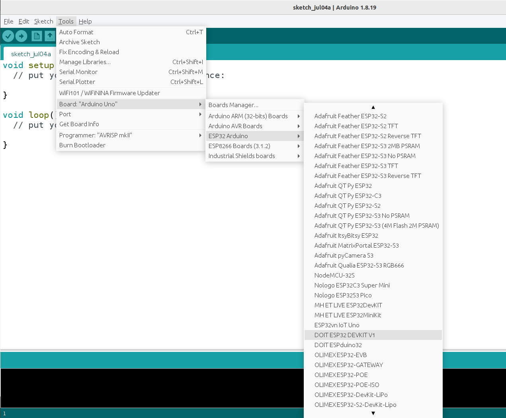

# ANEXO 3 - Programación de tares de tiempo real en Raspberry Pi 4 con PREEMPT_RT

La programación de tareas con requisitos de tiempo real en un sistema operativo (SO) Linux (los mas típicamente soportados por las tarjetas Raspberry Pi) se puede lograr utilizando versiones especializadas del kernel. Específicamente empleando un parche nombrado **"PREEMPT_RT"**, el cual convierte el kernel estándar de Linux en un kernel de tiempo real "blando" (soft real-time), adecuado para muchas aplicaciones industriales y de investigación.

PREEMPT_RT logra la capacidad de tiempo real en Linux a través de una serie de modificaciones y mejoras específicas al kernel. Las dos mas relevantes son:

- **Preemptibilidad Completa:** En un kernel estándar de Linux, ciertas secciones de código no pueden ser interrumpidas, lo que puede causar retrasos impredecibles en la respuesta del sistema a eventos de tiempo real. PREEMPT_RT permite que tareas de mayor prioridad interrumpan casi cualquier proceso del SO. Esto reduce significativamente la latencia.
- **Ajustes en el Planificador:** El planificador de tareas en PREEMPT_RT está mejorado para manejar las políticas de planificación SCHED_FIFO y SCHED_RR de manera más eficiente, garantizando que las tareas de alta prioridad obtengan el tiempo de CPU necesario.

## 3.1 Instalación del parche PREEMPT_RT para Raspberry Pi OS

En primera instancia se debe abordar el método para modificar el comportamiento del kernel, mediante la inclusión del parche "PREEMPT_RT". A continuación se detallarán los pasos para conseguirlo, tenga en cuenta que los componente empleados durante esta explicación son:

- Una Raspberry Pi 4 
- Una PC con sistema operativo Linux (Ubuntu 22.04 LTS) 
- Una tarjeta microSD (Con capacidad para 16 Gb o superior)

**Nota: La capacidad de cómputo de la PC repercute directamente en la duración del proceso de compilación cruzada del Kernel, por ende, trate de emplear una PC con un procesador multi-nucleo de alta potencia.* 

### Instalar Raspberry Pi OS (64 bits)

Existen diversos métodos para instalar una imagen del sistema Raspberry Pi OS en una tarjeta SD, en esta guía se empleará la herramienta **Raspberry Pi Imager**.

#### 1) Instalar y ejecutar Raspberry Pi Imager en la PC
En una PC con sistema operativo Ubuntu 22.04, abra una terminal y ejecute los siguiente comandos:

```bash
sudo apt update
sudo apt install rpi-imager
```
Tras completar la instalaación, ejecute el programa mediante el siguiente comando:
```bash
rpi-imager
```
Esto desplegará la siguiente ventana:



#### 2) Conecte la tarjeta micro SD a la PC
Ya sea mediante un adaptador USB o un lector de tarjetas SD integrado en el equipo, conecte la tarjeta microSD al PC

#### 3) Seleccione el sistema operativo
Haga clic sobre el botón "Escoger sistema operativo/Choose OS" de la interfaz del Raspberry Pi Imager y de la lista que se despliega seleccione la opción **"Raspberry Pi OS (64-bit)"** como se aprecia en la imagen.


#### 3) Seleccione la tarjeta micro SD donde se almacenará la imagen del SO
Haga clic sobre el botón "Escoger almacenamiento/Choose Storage" en la interfaz del Raspberry Pi Imager y de la lista que se despliega seleccione la opción correspondiente a la tarjeta microSD conectada. Tenga precaución con el medio de almacenamiento seleccionado, pues este será formateado durante el proceso, con lo cual la información previamente almacenada se eliminará de forma permanente.


#### 4) Escriba la imagen del sistema operativo en la tarjeta
Finalmente haga clic sobre el botón de "Escribir/Write" y confirme el inicio del proceso en la ventana emergente. Esto iniciará el proceso de escritura del SO en la tarjeta micro SD. Espere a que la instalación y verificación concluyan.

#### 5) Retire la tarjeta micro SD del PC e insertela en el socket correspondiente de la tarjeta Raspberry Pi 4
Tras observar el mensaje de notificación de la correcta instalación de la imagen del sistema operativo, retire la tarjeta del PC e insertela en la Raspberry Pi 4.

#### 6) Realizar la configuración inicial del sistema operativo
Tras haber insertado la tarjeta micro SD, conecte un monitor mediante HDMI a la Raspberry Pi 4, así como mouse y teclado. Posteriormente alimente con corriente eléctrica la tarjeta mediante su puerto USB tipo C. Siga los pasos que se irán solicitando en el monitor para configurar el sistema operativo. 

### Compilación cruzada del Kernel con el parche PREEMPT_RT

Tras tener correctamente instaldo el sistema operativo en la tarjeta Raspberry Pi, el paso restante es parchear su kernel. Debido a que la compilación del kernel es un proceso que requiere de una alta demanda computacional, realizarlo directamente en la Raspberry Pi, aunque es totalmente posible, implica un tiempo significativamente alto, por lo tanto se emplea "compilación cruzada", es decir, compilar el kernel en una máquina más potente (PC con Linux) y luego transferir los archivos compilados a la Raspberry Pi.

***NOTA:** El proceso de compilación del kernel con el parche PREEMPT_RT se presenta en esta guía con un caracter principalmente demostrativo, siendo realmente útil en el momento que se pretanda actualizar por algún motivo la versión del Kernel del sistema opearativo. Mas allá de eso, se recomienda usar los archivos que ya han sido compilados y que están disponibles en este repositorio. 

#### 0) Verificación de la versión y tipo de kernel preinstalado

Aunque este paso no es estrictamente necesario, se recomienda visualizar la versión y tipo de kernel que se instala por defecto en la imagen del Raspberry Pi OS. Para ello en la Raspberry Pi 4, abra una terminal y ejecute el comando ```uname -a```, lo cual debe generar una salida similar a esta:

```bash
Linux raspberrypi 6.6.31+rpt-rpi-v8 #1 SMP PREEMPT Debian 1:6.6.31-1+rpt1 (2024-05-29) aarch64 GNU/Linux
```
De esta se destacan dos valores, el primero es la versión del kernel "6.6.31+rpt-rpi-v8" y el segundo el modelo del kernel "PREEMPT". En estos dos parámetros se evidenciarán cambios tras realizar la correcta instalación del kernel parcheado.

Al momento de escribir esta guía, la versión más reciente del Raspberry Pi OS emplea por defecto la versión de kernel "6.6.31", esta será la versión de kernel a emplear durante el resto de procedimientos.

#### 1) Preparar el Entorno de compilación en la PC

En la PC, en su directorio raíz abra una terminal y cree una carpeta empleando los siguientes comandos:

```bash
mkdir ~/kernel_build
cd ~/kernel_build
```

A continuación, instale las herramientas necesarias para la compilación del kernel usando estos comandos:

```bash
sudo apt-get update
sudo apt-get install gcc-aarch64-linux-gnu build-essential bc bison flex libssl-dev make
```


### Instalación
