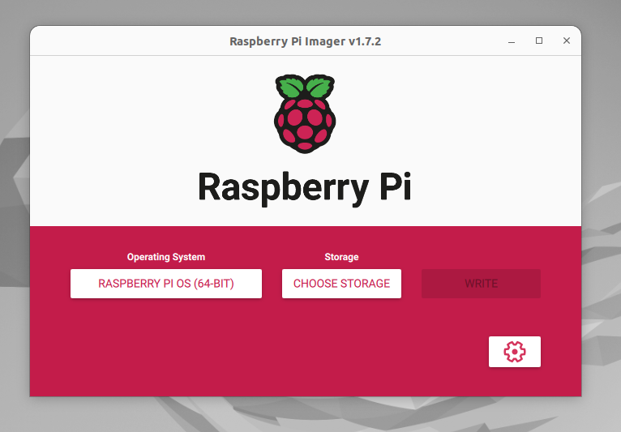
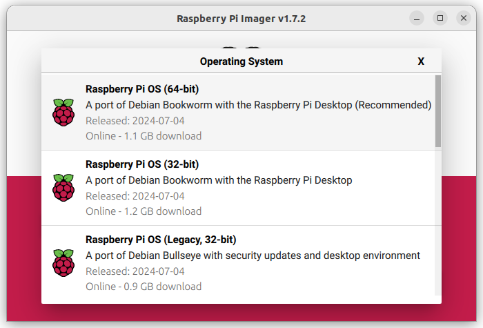
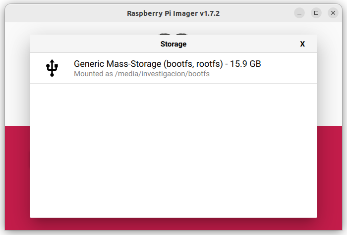
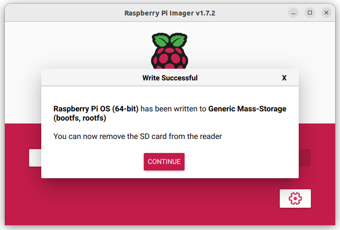

# ANEXO 3 - Programación de tares de tiempo real en Raspberry Pi con PREEMPT_RT
La programación de tareas con requisitos de tiempo real en un sistema operativo (SO) Linux (los mas típicamente soportados por las tarjetas Raspberry Pi) se puede lograr utilizando versiones especializadas del kernel. Específicamente empleando un parche nombrado **"PREEMPT_RT"**, el cual convierte el kernel estándar de Linux en un kernel de tiempo real "blando" (soft real-time), adecuado para muchas aplicaciones industriales y de investigación.

PREEMPT_RT logra la capacidad de tiempo real en Linux a través de una serie de modificaciones y mejoras específicas al kernel. Las dos mas relevantes son:

- **Preemptibilidad Completa:** En un kernel estándar de Linux, ciertas secciones de código no pueden ser interrumpidas, lo que puede causar retrasos impredecibles en la respuesta del sistema a eventos de tiempo real. PREEMPT_RT permite que tareas de mayor prioridad interrumpan casi cualquier proceso del SO. Esto reduce significativamente la latencia.
- **Ajustes en el Planificador:** El planificador de tareas en PREEMPT_RT está mejorado para manejar las políticas de planificación SCHED_FIFO y SCHED_RR de manera más eficiente, garantizando que las tareas de alta prioridad obtengan el tiempo de CPU necesario.

## 3.1 Instalación del parche PREEMPT_RT para Raspberry Pi OS
En primera instancia se debe abordar el método para modificar el comportamiento del kernel, mediante la inclusión del parche "PREEMPT_RT". A continuación se detallarán los pasos para conseguirlo, tenga en cuenta que los componente empleados durante esta explicación son:

- Una Raspberry Pi 4 
- Una PC con sistema operativo Linux (Ubuntu 22.04 LTS) 
- Una tarjeta microSD (Con capacidad para 16 Gb o superior)

**Nota: La capacidad de cómputo de la PC repercute directamente en la duración del proceso de compilación cruzada del Kernel, por ende, trate de emplear una PC con un procesador multi-nucleo de alta potencia.* 

### Instalar Raspberry Pi OS (64 bits)
Existen diversos métodos para instalar una imagen del sistema Raspberry Pi OS en una tarjeta SD, en esta guía se empleará la herramienta **Raspberry Pi Imager**.

#### 1) Instalar y ejecutar Raspberry Pi Imager en la PC
En una PC con sistema operativo Ubuntu 22.04, abra una terminal y ejecute los siguiente comandos:

```bash
sudo apt update
sudo apt install rpi-imager
```
Tras completar la instalaación, ejecute el programa mediante el siguiente comando:
```bash
rpi-imager
```
Esto desplegará la siguiente ventana:



#### 2) Conecte la tarjeta micro SD a la PC
Ya sea mediante un adaptador USB o un lector de tarjetas SD integrado en el equipo, conecte la tarjeta microSD al PC

#### 3) Seleccione el sistema operativo
Haga clic sobre el botón "Escoger sistema operativo/Choose OS" de la interfaz del Raspberry Pi Imager y de la lista que se despliega seleccione la opción **"Raspberry Pi OS (64-bit)"** como se aprecia en la imagen.



#### 4) Seleccione la tarjeta micro SD donde se almacenará la imagen del SO
Haga clic sobre el botón "Escoger almacenamiento/Choose Storage" en la interfaz del Raspberry Pi Imager y de la lista que se despliega seleccione la opción correspondiente a la tarjeta microSD conectada. Tenga precaución con el medio de almacenamiento seleccionado, pues este será formateado durante el proceso, con lo cual la información previamente almacenada se eliminará de forma permanente.


#### 5) Escriba la imagen del sistema operativo en la tarjeta
Finalmente haga clic sobre el botón de "Escribir/Write" y confirme el inicio del proceso en la ventana emergente. Esto iniciará el proceso de escritura del SO en la tarjeta micro SD. Espere a que la instalación y verificación concluyan.


#### 6) Retire la tarjeta micro SD del PC e insertela en el socket correspondiente de la tarjeta Raspberry Pi 4
Tras observar el mensaje de notificación de la correcta instalación de la imagen del sistema operativo, retire la tarjeta del PC e insertela en la Raspberry Pi 4.



#### 7) Realizar la configuración inicial del sistema operativo
Tras haber insertado la tarjeta micro SD, conecte un monitor mediante HDMI a la Raspberry Pi 4, así como mouse y teclado. Posteriormente alimente con corriente eléctrica la tarjeta mediante su puerto USB tipo C. Siga los pasos que se irán solicitando en el monitor para configurar el sistema operativo. 

### Compilación cruzada del Kernel con el parche PREEMPT_RT

Tras tener correctamente instaldo el sistema operativo en la tarjeta Raspberry Pi, el paso restante es parchear su kernel. Debido a que la compilación del kernel es un proceso que requiere de una alta demanda computacional, realizarlo directamente en la Raspberry Pi, aunque es totalmente posible, implica un tiempo significativamente alto, por lo tanto se emplea "compilación cruzada", es decir, compilar el kernel en una máquina más potente (PC con Linux) y luego transferir los archivos compilados a la Raspberry Pi.

***NOTA:** El proceso de compilación del kernel con el parche PREEMPT_RT se presenta en esta guía con un caracter principalmente demostrativo, siendo realmente útil en el momento que se pretanda actualizar por algún motivo la versión del Kernel del sistema opearativo. Mas allá de eso, se recomienda usar los archivos que ya han sido compilados y que están disponibles en este repositorio, avanzando directamente a la sección [**Instalación del Kernel en la Raspberry Pi**](#instalación-del-kernel-en-la-Raspberry-Pi). 

#### 0) Verificación de la versión y tipo de kernel preinstalado

Aunque este paso no es estrictamente necesario, se recomienda visualizar la versión y tipo de kernel que se instala por defecto en la imagen del Raspberry Pi OS. Para ello en la Raspberry Pi 4, abra una terminal y ejecute el comando ```uname -a```, lo cual debe generar una salida similar a esta:

```bash
Linux raspberrypi 6.6.31+rpt-rpi-v8 #1 SMP PREEMPT Debian 1:6.6.31-1+rpt1 (2024-05-29) aarch64 GNU/Linux
```
De esta se destacan dos valores, el primero es la versión del kernel "6.6.31+rpt-rpi-v8" y el segundo el modelo del kernel "PREEMPT". En estos dos parámetros se evidenciarán cambios tras realizar la correcta instalación del kernel parcheado.

Al momento de escribir esta guía, la versión más reciente del Raspberry Pi OS emplea por defecto la versión de kernel "6.6.31", esta será la versión de kernel a emplear durante el resto de procedimientos.

#### 1) Preparar el Entorno de compilación en la PC

En la PC, en su directorio raíz abra una terminal y cree una carpeta empleando los siguientes comandos:

```bash
mkdir ~/kernel_build
cd ~/kernel_build
```

A continuación, instale las herramientas necesarias para la compilación del kernel usando estos comandos:

```bash
sudo apt-get update
sudo apt-get install gcc-aarch64-linux-gnu build-essential bc bison flex libssl-dev make
```

#### 2) Descargar el código fuente del kernel

Descargue desde github el código fuente del kernel. Recuerde acceder al branch correspondiente a la versión de kernel que desea parchear e instalar. En este caso puntual es la versión "6.6", empleando entonces el siguiente comando: 

```bash
git clone --depth=1 -b rpi-6.6.y https://github.com/raspberrypi/linux
```
Tras completarse el procese anterior, ingrese a la carpeta que se obtiene como producto, usando el siguiente comando:

```bash
cd linux
```

#### 3) Buscar y descargar la versión adecuada del parche PREEMPT_RT

1) Ingrese a la dirección web ["https://www.kernel.org/pub/linux/kernel/projects/rt/"](https://www.kernel.org/pub/linux/kernel/projects/rt/) y posteriormente a la carpeta correspondiente a la versión del kernel que se ha descargado. En este caso a la "6.6".
2) Al interior de dicha carpeta encontrará un listado con todas las versiones del parche disponibles para la respectiva versión del kernel. Identifique la versión de parche que desea instalar, en este caso instalaremos la última versión disponible al momento de redactar esta guía "6.6.36-rt35".

Tras haber identificado la versión del parche a usar, en la misma terminal que ha venido usando hasta el momento (verificando que la ruta sea ~/kernel_build/linux/), ejecute el siguiente comando para descargar el parche PREEMPT_RT:

```bash
wget https://www.kernel.org/pub/linux/kernel/projects/rt/6.6/patch-6.6.36-rt35.patch.xz
```

**Nota: Modifique la ruta del archivo a descargar en función de la versión del parche*

#### 4) Configurar los parámetros de compilación en el PC para que el Kernel sea apto para Raspberry Pi

Para configurar los parámetros del compilador, en la terminal ejecute el siguiente comando:

```bash
make ARCH=arm64 CROSS_COMPILE=aarch64-linux-gnu- bcm2711_defconfig
```

#### 5) Aplicar el parche de PREEMPT_RT

Para hacer efectivos los cambios que PREEMPT_RT aplica sobre el kernel base de linux se debe ejecutar el siguiente comando en la terminal:

```bash
patch -p1 < patch-6.6.36-rt35.patch
```
Verifique que el nombre del parche a aplicar coincida con el descargado

#### 6) Configurar el kernel para favorecer la ejecución de tareas con requisitos de tiempo real

Las configuraciones el kernel se hacen a traves de una interfaz de configuración a la cual se accede mediante el siguiente comando:

```bash
make ARCH=arm64 CROSS_COMPILE=aarch64-linux-gnu- menuconfig
```

Dentro de este menú, emplee las flechas del teclado para navegar entre las opciones. Con las techas de arriba y abajo se mueve por las opciones de la lista y con las techlas laterales se desplaza entre las acciones. Hay dos configuraciones principales que se deben realizar para favorecer la ejecución de tareas con requisitos de tiempo real, estas son activar el modo **"Fully Preemptible Kernel (RT)"** e incrementar la frecuencia del timer. Para ello:

**- Activar el modo Fully Preemptible Kernel (RT)**
1) Con la opción **"General setup"** resaltada en la lista y **"Select"** en las acciones, presione la tecla enter.
--Insertar imagen
2) Baje en la lista hasta resaltar la opción **"Preemption Model (...)"** y con la acción **"Select"** resaltada, presione enter.
--Insertar imagen
3) Baje hasta resaltar la opción **"Fully Preemptible Kernel (Real-Time)"** y presione la tecla barra espaciadora. Esto hará que la opción se marque con una X. Posteriormente presione enter.
--Insertar imagen
4) Regrese a la lista inicial de opciones usando las teclas laterales para seleccionar la acción **"Exit"** y presionando la tecla enter.

**- Incrementar la frecuencia del timer**
1) Con la opción **"Kernle Features"** resaltada en la lista y **"Select"** en las acciones, presione la tecla enter.
--Insertar imagen
2) Baje en la lista hasta resaltar la opción **"Timer frequency (...)"** y con la acción **"Select"** resaltada, presione enter.
--Insertar imagen
3) Baje hasta resaltar la opción **"1000 Hz"** y presione la tecla barra espaciadora. Esto hará que la opción se marque con una X. Posteriormente presione enter.
--Insertar imagen
4) Regrese a la lista inicial de opciones usando las teclas laterales para seleccionar la acción **"Exit"** y presionando la tecla enter.

**-Guardar los cambios y salir**
1) Usando las teclas laterales resalte la opción **"Save"** y posteriormente presione la tecla enter.
2) En el menú que se despliega, verificando que el nombre del archivo en el cual se guardará la configuración sea ".config" y que la acción resaltada sea **"Ok"** presione enter.
3) Se le confirmará que los combios fueron grabados. Presione enter para continuar.
4) Usando las flechas laterales, resalte la acción **"Exit"** y presione enter.

#### 7) Compilar el kernel

Tras haber instalado el parche y configurado el kernel, se procede a la compilación. Para ello, desde la misma terminal, ejecute el siguiente comando:

```bash
make -j$(nproc) ARCH=arm64 CROSS_COMPILE=aarch64-linux-gnu- Image modules dtbs
```
Este proceso puede tardar varios minutos. Este tiempo dependerá de la capacidad de cómputo del PC.

#### 8) Instalar los módulos en un directorio externo

Tras concluir la compilación, debe instalar los módulos en un directorio externo, al cual se le ha asignado arbitrariamente como nombre "install". Para ello en primera instancia cree el directorio y un subdirectorio, mediante el siguiente comando desde la misma terminal que ha estado utilizando:

```bash
mkdir -p ~/kernel_install/install/modules
```

Una vez creado el directorio, instale los módulos en él empleando el siguiente comando:

```bash
make ARCH=arm64 CROSS_COMPILE=aarch64-linux-gnu- INSTALL_MOD_PATH=~/kernel_install/install/modules modules_install
```

### Empaquetar el kernel parcheado

Tras haber parcheado, configurado, compilado el kernel, lo que resta es empaquetarlo en un archivo comprimido para ser transferido por algún medio (vía USB, SCP, Internet, etc..) a la Raspberry Pi y finalmente ser instalado.

#### 1) Crear Directorios para Kernel y Device Trees:

En el mismo directorio previamente creado, cree otrad carpetad, usando el siguiente comando:

```bash
mkdir -p ~/kernel_install/install/boot/overlays
```

#### 2) Copiar el Kernel y los Device Trees al Directorio Temporal:

Con los directorios creados, se debe copiar los archivos que componen al Kernel y sus Device Trees, para ello utilice los siguientes comandos:

```bash
cp arch/arm64/boot/Image ~/kernel_install/install/boot/kernel8.img
```
```bash
cp arch/arm64/boot/dts/broadcom/*.dtb ~/kernel_install/install/boot
```
```bash
cp arch/arm64/boot/dts/overlays/*.dtb* ~/kernel_install/install/boot/overlays/
```
```bash
cp arch/arm64/boot/dts/overlays/README ~/kernel_install/install/boot/overlays/
```

#### 3) Empaquetar el Directorio Temporal en un Archivo Comprimido

Ingrese desde la terminal a la carpeta de instalación temporal, usando el siguiente comando:

```bash
cd ~/kernel_install/install
```
Posteriormente ejecute el siguiente comando para empaquetar los archivos del kernel en un archivo comprimido

```bash
tar -czvf kernel_patch.tar.gz boot modules
```

### Instalación del Kernel en la Raspberry Pi

**El archivo comprimido con el kernel parcheado y listo para instalación está disponible en la carpeta **INSERTAR CARPETA AQUI**

Transfiera el archivo comprimido por el medio de su preferencia a la Raspberry Pi 4. Para no tener que hacer modificaciones a los comandos presentados en esta guía, disponga el archivo comprimido en la carpeta raiz de la Raspberry Pi 4.

#### 1) Crear una carpeta para desempaquetar el archivo

Abra una terminal en la carpeta raiz "~" de la Raspberry Pi y posteriormente ejecute este comando:

```bash
mkdir -p ~/kernel_install/
```

En la misma terminal ejecute el siguiente comando para desempaquetar los archivos:

```bash
tar -xzvf kernel_patch.tar.gz -C ~/kernel_install
```

#### 2) Instalar los Archivos del Kernel y los Módulos

Para realizar la instalación de los archivos basta con copiarlos en las carpetas correspondientes del sistema operativo. Para ello ejecute los siguientes comandos en la terminal:

```bash
sudo cp ~/kernel_install/boot/kernel8.img /boot/firmware/
sudo cp ~/kernel_install/boot/*.dtb /boot/firmware/
sudo cp ~/kernel_install/boot/overlays/*.dtb* /boot/firmware/overlays/
sudo cp ~/kernel_install/boot/overlays/README /boot/firmware/overlays/
sudo cp -r ~/kernel_install/modules/lib/modules/* /lib/modules/
```
Para que el arranque del sistema operativo se ejecute efectivamente con el kernel parcheado, se requiere tambien modificar el archivo de configuración que se encuentra en la ruta "/boot/firmware/config.txt". Para editar este archivo puede emplear el siguiente comando:

```bash
sudo nano /boot/firmware/config.txt
```

Cuando en la terminal se muestre el contenido del archivo, agregue la siguiente línea de configuración al archivo, justo antes de la etiqueta "cm4":

```bash
kernel=kernel8.img
```

Guarde los cambios presionando "Ctrl + o", luego presiona "Enter" para confirmar y finalmente salga del editor presionando "Ctrl + X".

### Reinicio y Verificación de la correcta instalación del Kernel

Una vez transferidos todos los archivo a su ubicación y habiendo editado config.txt, reinicie la Raspberry Pi, usando este comando en la terminal:

```bash
sudo reboot
```
Al concluir el proceso de reinicio (puede tardar mas de lo habitual) y estar de nuevo en la página de inicio de la interfaz de Raspberry Pi OS, abra una terminal y ejecute el comando ```uname -a```. La salida esperada de este comando debe ser:

```bash
Linux raspberrypi 6.6.37-rt35-v8+ #1 SMP PREEMPT_RT Tue Jul  9 14:53:17 -05 2024 aarch64 GNU/Linux
```
Donde se observa que la versión del kernel refleja la instalación del parche rt y que el modo del kernel ahora está configurado como "PREEMPT_RT", confirmando que el proceso de instalación fue exitoso.


