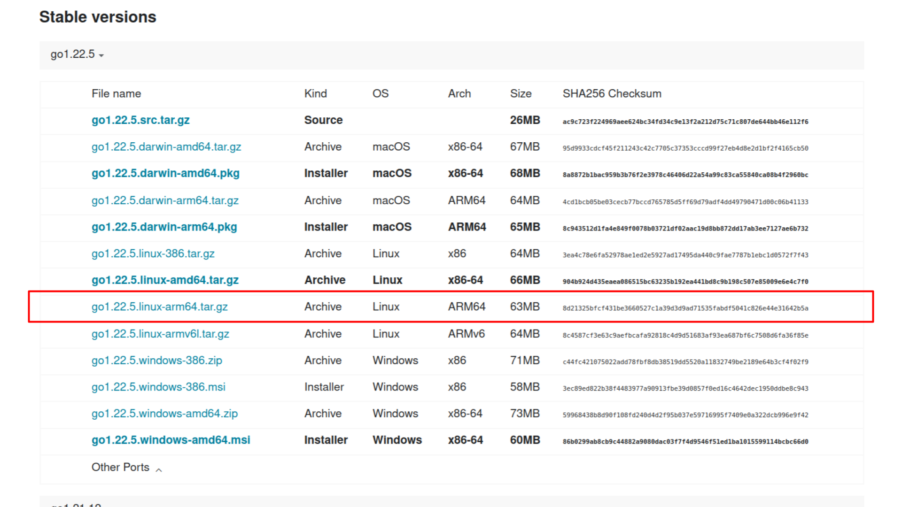
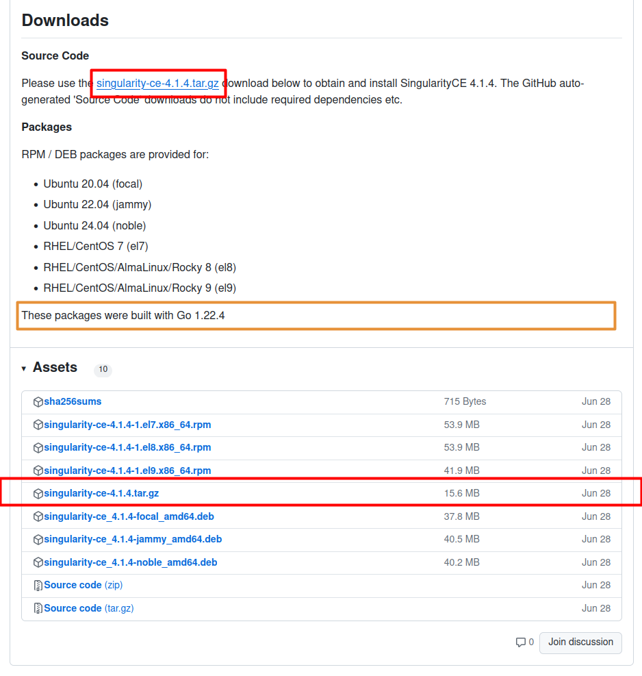

# ANEXO 5 -  Ejecución de nodos ROS2 en Raspberry Pi usando contenedores Singularity

ROS 2 (Robot Operating System 2) es un conjunto de bibliotecas y herramientas diseñadas para ayudar a los desarrolladores a crear aplicaciones principalmente en el campo de la robótica. ROS 2 utiliza DDS (Data Distribution Service) como su middleware de comunicación, permitiendo una comunicación más robusta y flexible entre nodos en una red distribuida, representando una alternativa muy practica para el desarrollo de aplicaciones industriales en general. Los componentes de ROS 2 están diseñados para ser modulares, lo que facilita la personalización y escalabilidad del sistema según las necesidades del proyecto.

ROS2 para sistemas Linux se soporta en la distribución Ubuntu, por lo tanto, para conseguir su ejecución en una plataforma Rasoberry Pi es recomendable hacerlo mediante contenedores de software. Un contenedor de software es una tecnología que permite empaquetar una aplicación y todas sus dependencias (como bibliotecas, herramientas del sistema y configuraciones) en una sola unidad ejecutable. Esta unidad se llama "contenedor" y se caracteriza por ejecutarse de manera consistente en cualquier entorno que soporte la tecnología de contenedores, sin importar las diferencias en la infraestructura subyacente. Los contenedores son una forma de virtualización a nivel de sistema operativo que proporcionan aislamiento y eficiencia. 

Entre las alternativas mas conocidas para ejecutar contenedores se encuentran Docker y Singularity. Docker es ampliamente utilizado en la industria, soportando la creación de contenedores ligeros y portátiles con una gran comunidad y ecosistema de herramientas. Singularity, por otro lado, está optimizado para entornos HPC (High-Performance Computing) y científicos, permitiendo la ejecución de contenedores sin privilegios de root, garantizando mayor seguridad y compatibilidad con sistemas de archivos y recursos del host. Singularity está diseñado para integrarse más estrechamente con el sistema operativo host, aprovechando los recursos del hardware de manera más eficiente y reduciendo en gran medida la sobrecarga que podría introducirse con la virtualización. Tras realizar algunas pruebas se verificó que las tareas ejecutadas en contenedores de Singularity se desempeñaban con un comportamiento mas cercano al nativo en comparación a tareas en contenedores de Docker. Este es un factor deseable al momento de desarrollar aplicaciones de automatización industrial, en esepcial aquellas que deben cumplir con requisitos de tiempo real. 

A continuación se presentan los pasos para lograr la ejecución de nodos de ROS2 en una Raspberry Pi 4 mediante contenedores de Singularity.

# 5.1 - Instalación de Singularity

## Paso 1 - Instalar Go

Go, también conocido como Golang, es un lenguaje de programación desarrollado por Google, con el cual fue desarrollado Singularity, por lo tanto es un requisito para su ejecución. 

### 1) Descargar el código fuente de Go

Ingrese al [sitio oficial de Go](https://go.dev/dl/) y descargue el archivo correspondiente a sistema operativo Linux y arquitectura ARM64, de modo que sea compatible con Raspberry Pi OS. Al momento de redactada esta documentación, la última versión de Go disponible es la 1.22.25



### 2) Instalar los archivos

- Abra una terminal y navegue hasta la carpeta en la que se descargó el archivo, por defecto esta ruta es ~/Downloads, para ello puede usar el siguiente comando:

```sh
cd ~/Downloads
```
- Extraer el archivo tar de Go, para ello ingrese el siguiente comando en la terminal:

```sh
sudo tar -C /usr/local -xzf go1.22.5.linux-arm64.tar.gz
```
### 3) Configurar las variables de entorno

- En una terminal, abra el archivo ".profile" usando el siguiente comando:
```sh
sudo nano ~/.profile
```

- Copie y pegue las siguientes líneas al final del archivo (Ctrl+Shift+c y Ctrl+Shift+v):  
```sh
export PATH=$PATH:/usr/local/go/bin
export GOPATH=$HOME/go
export PATH=$PATH:$GOPATH/bin
```
- Guarde los cambios realizados al archivo (Ctrl+s) y cierre el archivo (Ctrl+x)
- Ejecuta el siguiente comando para aplicar los cambios:
```sh
source ~/.profile
```
### 4) Verificar la instalación
- Para verificar que Go se ha instalado correctamente, en una terminal ejecute el siguiente comando:
```sh
go version
```
- Como respuesta al comando ingresado anteriormente deberá encontrar la versión de Go, el sistema operativo y la arquitectura del sistema (go version go1.22.5 linux/arm64
)

## Paso 2 - Instalar Singularity

### 1) Verifique que estén instaladas todas las dependencias para la compilación
- Abra una terminal y verifique que todas las dependencias estén instaladas y actualizadas, para ello ejecute los siguientes comandos:
```sh
sudo apt-get update
```
```sh
sudo apt-get install build-essential libssl-dev uuid-dev libgpgme11-dev squashfs-tools libseccomp-dev wget pkg-config git cryptsetup libseccomp-dev libglib2.0-dev libfuse-dev libfuse3-dev autoconf automake libtool
```

### 2) Descargar el código fuente de Singularity
- Ingrese al repositorio en GitHub de Singularity, en la sección de [releases](https://github.com/sylabs/singularity/releases) descargue la versión "general" del código fuente, haciendo clic en el enlace inmerso en el texto o en la sección assets.



***Importante:*** Verifique que la versión de Go instalada sea igual o superior a la versión con la que se compiló la versión de Singularity.


### 3) Preparar los archivos para compilar
- Abra una terminal y navegue hasta la carpeta en la que ha descargado el archivo comprimido de singulárity, por defecto la carpeta de descargas, para ello puede usar el siguiente comando:
```sh
cd ~/Downloads
```
- Descomprima el archivo usando el siguiente comando:
```sh
tar -xzf singularity-ce-4.1.4.tar.gz
```
- Ingrese a la carpeta producto de la descompresión:
```sh
cd singularity-ce-4.1.4/
```
- Navegue hasta el directorio "squashfuse":
```sh
cd third_party/squashfuse
```
- Configure el entorno automáticamente para la compilación ejecutando el comando:
```sh
autoreconf -i 
```
- Retorne a la ruta de la carpeta principal:
```sh
cd ../..
```  

### 4) Compilación e Instalación
- Ejecute en orden los siguientes comandos:
```sh
./mconfig 
```
```sh
make -C builddir
```
```sh
sudo make -C builddir install
```

### 5) Verificar la instalación
- Para verificar que singulárity ha sido correctamente instalado, un una nueva terminal ejecute el sifuiente comando:
```sh
singularity --version
```
- La salida obtenida debe ser similar "singularity-ce version 4.1.4".

***Importante:*** Todos los comandos y salidas deberán ser modificados en función de la versión a instalar de Singulárity, en este ejemplo se instaló la última version disponible (4.1.4).

## Paso 3 - Crear un contenedor de Singularity a partir de una imagen con ROS2 preinstalado

Los contenedores Singularity se producen a partir de imágenes inmutables en el formato Singularity Image File (SIF). Esto garantiza imágenes reproducibles y verificables y permite muchos beneficios adicionales, como la capacidad de firmar y verificar sus contenedores. Sin embargo, durante las pruebas y la depuración es posible es deseable un formato de imagen en el que se pueda escribir. De esta manera, poder instalar software y dependencias hasta asegurar el correcto funcionamiento de la aplicación a contenerizar. Para estos escenarios, Singularity admite el formato ***"sandbox"***. Este es básicamente un directorio editable a partir del cual es posible crear contenedores.

Otra ventaja que ofrece Singularity es la de crear imágenes a partir de las disponibles en el repositorio de Docker. Aprovechando esta característica, se pueden crear sandbox que contenga ROS2 preinstalado, para ello basta con ejecutar seguir este procedimiento: 

- Abra una terminal y navegue a su directorio home:
```sh
cd ~
```
- Cree una carpeta, para la cual se sigiere el nombre "singularity_containers" y posteriormente ingrese a la carpeta:
```sh
mkdir singularity_containers
cd singularity_containers/
```
- Ejecute el siguiente comando para crear el sandbox:
```sh
sudo singularity build --sandbox --arch arm64 ROS2/ docker://ros:humble-ros-base
```
Explorando este comando encontramos en orden tras el comando "build", que permite crear imágenes, la bandera que indica que se va a construir una imagen de tipo sandbox, la arquitectura de la plataforma host, el nombre que tendrá la imagen y el archivo a partir del cual se va a crear, en este caso, una imagen previa alojada en el repositorio de Docker (DockerHub). En este caso una imagen de ubuntu con la versión "humble" de ROS2 preinstalada.

Esto crea entonces una carpeta llamada ROS2, que corresponde al archivo a partir del cual se pueden construir los contenedores y se podrá modificar segun se requiera en función a la aplicación a desarrollar.

## Paso 4 - Editar la imagen para agregar nodos de ROS2

Tras haber creado un sandbox con ROS2, vamos a modificar la imagen para instalar un par de nodos de ROS2.

### 1) Crear un contenedor para editar la imagen

- Abra una terminal y diríjase a la ruta en la que se encuentra el sandbox previamente creado:
```sh
cd ~/singularity_containers/
```

- Mediante el comando ```shell``` se crea automáticamente un contenedor a partir de la imagen seleccionada y se enlaza la terminal para poder ejecutar comandos dentro del entorno contenerizado. Mediante la bandera ```-w``` o ```-writeable``` podremos modificar la imagen o sandbox a partir de la cual se generó el contenedor. Ejecute entonces el siguiente comando:
```sh
sudo singularity shell -w ROS2/
```

### 2) Crear un espacio de trabajo (workspace) de ROS2
- En la misma terminal, la cual ahora está enlazada con el contenedor, ejecute los siguientes comandos para actualizar las librerias e instalar un procesador de texto que funcione desde la terminal (nano, vim, o el que sea de su preferencia):
```sh
apt update
apt upgrade
apt install nano
```

- Cree una carpeta en la raiz del contenedor:
```sh
mkdir -p /ros2_ws/src
```

### 3) Crear un paquete de ROS2
- Navegue hasta la carpeta creada para el espacio de trabajo:
```sh
cd /ros2_ws/src
```

- Inicie el entorno de ros2:
 ```sh
source /opt/ros/humble/setup.bash 
```  

- Cree un paquete de ros, con el siguiente comando:
 ```sh
ros2 pkg create --build-type ament_cmake --license Apache-2.0 cpp_pubsub
```  
Este comando define mediante el parámetro "--build-type" establecido en "ament_cmake" que el compilador recibirá código fuente en lenguaje C/C++, que el paquete se crea bajo la licencia Apache-2.0 y por último que el nombre del paquete será cpp_pubsub.

Tras ejecutar el comando se creará una carpeta con el nombre seleccionado (cpp_pubsub) y en su interior 3 archivos (CMakeLists.txt, LICENSE, package.xml) y dos subcarpetas (include y scr). 

### 4) Crear el código fuente de los nodos
- Navegue hasta la carpeta src del paquete previamente creado:
```sh
cd /ros2_ws/src/cpp_pubsub/src/
```

- Cree dos archivos con extensión .cpp con los siguientes nombres:
```sh
touch publicador.cpp subscriptor.cpp
```

- Abra el archivo "publicador.cpp" con un editor, para ello existen dos opciones:  

#### Opción 1: 
La primera opción es editar el archivo directamente en el entorno contenerizado mediante un editor en consola, es decir, en la misma terminal que se enlazó al contenedor al ejecutar el comando singularity shell. Así pues, usando la misma terminal empleada para crear el paquete y los archivos, asegúrese de estar en la ruta correcta y abra el archivo usando nano:
```sh
cd /ros2_ws/src/cpp_pubsub/src/
nano publicador.cpp
```

#### Opción 2: 
Puede abrir y editar archivos mediante un editor con interfaz gráfica del sistema host. Recuerde que la imagen al ser un sandobox es tambien una carpeta accesible mediante el gestor de archivos de la Raspberry Pi, con lo cual si prefiere, puede modificar el archivo usando un procesador de texto gráfico como gedit. Para ello abra una nueva terminal y ejecute loa siguientea comandos:
```sh
cd ~/singularity_containers/ROS2/ros2_ws/src/cpp_pubsub/src/
sudo xdg-open publicador.cpp
```

- Tras haber abierto el archivo "publicador.cpp" por el método de su preferencia, agregue el siguiente código al contenido del archivo, guardelo y cierrelo.
```cpp
#include <chrono>
#include <functional>
#include <memory>
#include <string>

#include "rclcpp/rclcpp.hpp"
#include "std_msgs/msg/string.hpp"

using namespace std::chrono_literals;

/* This example creates a subclass of Node and uses std::bind() to register a
* member function as a callback from the timer. */

class MinimalPublisher : public rclcpp::Node
{
  public:
    MinimalPublisher()
    : Node("minimal_publisher"), count_(0)
    {
      publisher_ = this->create_publisher<std_msgs::msg::String>("topic", 10);
      timer_ = this->create_wall_timer(
      500ms, std::bind(&MinimalPublisher::timer_callback, this));
    }

  private:
    void timer_callback()
    {
      auto message = std_msgs::msg::String();
      message.data = "Hello, world! " + std::to_string(count_++);
      RCLCPP_INFO(this->get_logger(), "Publishing: '%s'", message.data.c_str());
      publisher_->publish(message);
    }
    rclcpp::TimerBase::SharedPtr timer_;
    rclcpp::Publisher<std_msgs::msg::String>::SharedPtr publisher_;
    size_t count_;
};

int main(int argc, char * argv[])
{
  rclcpp::init(argc, argv);
  rclcpp::spin(std::make_shared<MinimalPublisher>());
  rclcpp::shutdown();
  return 0;
}
```
  
- De forma equivalente, abra el archivo "subscriptor.cpp" por el método de su preferencia y agregue el siguiente código al contendido del archivo, para posteriormente guardar y cerrar el archivo.

```cpp
#include <memory>

#include "rclcpp/rclcpp.hpp"
#include "std_msgs/msg/string.hpp"
using std::placeholders::_1;

class MinimalSubscriber : public rclcpp::Node
{
  public:
    MinimalSubscriber()
    : Node("minimal_subscriber")
    {
      subscription_ = this->create_subscription<std_msgs::msg::String>(
      "topic", 10, std::bind(&MinimalSubscriber::topic_callback, this, _1));
    }

  private:
    void topic_callback(const std_msgs::msg::String & msg) const
    {
      RCLCPP_INFO(this->get_logger(), "I heard: '%s'", msg.data.c_str());
    }
    rclcpp::Subscription<std_msgs::msg::String>::SharedPtr subscription_;
};

int main(int argc, char * argv[])
{
  rclcpp::init(argc, argv);
  rclcpp::spin(std::make_shared<MinimalSubscriber>());
  rclcpp::shutdown();
  return 0;
}
```

### 5) Agregar las dependencias del paquete

- Ahora se deben agregar dependencias al archivo "package.xml", el cual fue creado automáticamente al momento de crear el paquete, es decir que se encuentra dentro de la carpeta "cpp_pubsub". Para modificar este archivo puede utilizar cualquiera de los dos métodos anteriormente mencionados.
  - Si lo hace mediante la terminal enlazada al contenedor ejecute los siguientes comandos:
```sh
cd /ros2_ws/src/cpp_pubsub/src/
nano publicador.cpp
```
  - Si lo hace mediante el editor de las Raspberry Pi ejecute los siguientes comandos:
```sh
cd ~/singularity_containers/ROS2/ros2_ws/src/cpp_pubsub/src/
sudo xdg-open publicador.cpp
```

### 6) Agregar ejecutables al archivo de compilación

### 7) Construir el paquete

### 8) Ejecutar los nodos


