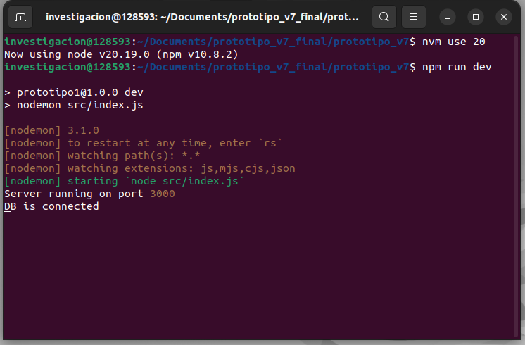
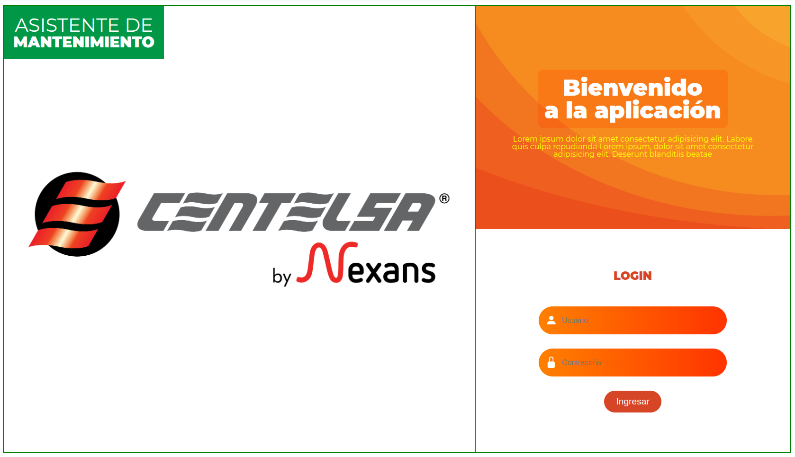

# Seguridad Funcional

## ⚙️ Requisitos previos  

Antes de ejecutar el prototipo, asegúrate de cumplir con lo siguiente:

1. **Descargar la carpeta correspondiente a `prototipo_v7`.**  
2. Tener instalado **Node.js** y **MongoDB** en tu sistema.  
   - [Descargar Node.js](https://nodejs.org/)  
   - [Instalación de MongoDB](https://www.mongodb.com/docs/manual/installation/)  
3. Verificar que **MongoDB esté corriendo** en tu máquina.  
   El estado debería verse similar a la siguiente imagen:  

   

---

## ▶️ Ejecución del prototipo

1. Dirígete a la carpeta descargada `prototipo_v7`.  
2. Haz **clic derecho** y selecciona **Abrir en Terminal**.  
   La ventana debería abrirse como en la siguiente imagen:  

   

3. En ese terminal, ejecuta los siguientes comandos:  

   ```bash
   nvm use 20
   npm run dev

4. Finalmente debe salir así la terminal

    

5. Para ejecutar el prototipo, ingresamos a nuestro buscador y ejecutamos el puerto

   ```bash
   http://localhost:3000/



   
