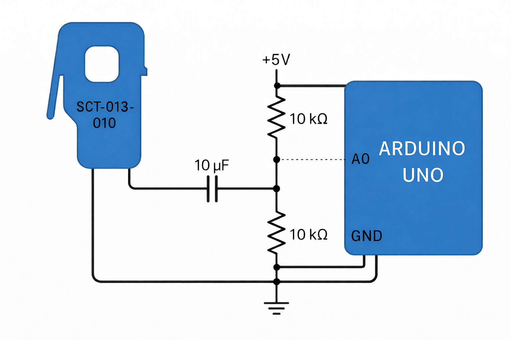

# Medición de Corriente AC con SCT-013 y Arduino UNO

Este proyecto implementa la lectura de corriente alterna (AC) utilizando el sensor **SCT-013-010** junto con un **Arduino UNO**.  
La señal del sensor es acondicionada mediante una **PCB**, la cual integra el circuito de polarización, filtrado y adaptación de nivel para su correcta lectura por el ADC del Arduino. Para luego mediante serial ser medido por el PLC 19R+

---

## 📌 Descripción general del sistema

El sensor **SCT-013-010** es un transformador de corriente no invasivo que genera una señal AC proporcional a la corriente que circula por un conductor.

Dado que el ADC del Arduino solo puede medir voltajes positivos (0–5 V), la señal del sensor debe ser:

- Desplazada a un nivel medio de 2.5 V  
- Filtrada  
- Limitada dentro del rango del ADC  

Todo este acondicionamiento se realiza directamente en la **PCB**, por lo que el Arduino únicamente recibe una señal lista para ser digitalizada.

---

## ⚙️ Código Arduino

El siguiente código realiza:

- Promediado de lecturas ADC  
- Conversión de cuentas ADC a voltaje  
- Eliminación del offset de 2.5 V para obtener la señal AC centrada en cero  

```cpp
void setup() {
  Serial.begin(115200);
}

void loop() {
  float senal = voltaje_promedio(10) * (5.0 / 1023.0) - 2.5;
  Serial.println(senal);
}

int voltaje_promedio(int n) {
  long suma = 0;
  for (int i = 0; i < n; i++) {
    suma = suma + analogRead(A0);
  }
  return (suma / n);
}
```
## 🔌 Diagrama de conexiones

El circuito de acondicionamiento (divisor resistivo, capacitor y polarización) se encuentra **integrado completamente en la PCB**.  
Por esta razón, el Arduino UNO solo requiere tres conexiones.



---

## 🔗 Conexiones PCB – Arduino UNO

| PCB | Arduino UNO |
|-----|-------------|
| VL  | A0          |
| GND | GND         |
| 5V  | 5V          |

---

## 🔗 Código y Ejecución del nodo en el PLC 
```cpp
  GNU nano 7.2                                                                                                                                                                                                                                                                      vrms.cpp                                                                                                                                                                                                                                                                               
#include <iostream>
#include <fstream>
#include <mqtt/async_client.h>
#include <thread>
#include <chrono>
#include <vector>
#include <json/json.h>
#include <fcntl.h>
#include <termios.h>
#include <unistd.h>
#include <cstring>

#define SERVER_ADDRESS "tcp://192.168.0.107:1883"
#define CLIENT_ID "Client_test_Centelsa"
#define TOPIC_SUBSCRIBE "/centelsa/mqtt/app/test/request"
#define TOPIC_PUBLISH "/centelsa/mqtt/app/test"
#define SERIAL_PORT "/dev/ttyACM0"

double leerDesdeSerial(int serial_port) {
    // Limpiar el buffer de entrada para evitar datos antiguos
    tcflush(serial_port, TCIFLUSH);

    char buffer[256];
    memset(&buffer, '\0', sizeof(buffer));

    usleep(100000);  // Esperar a que llegue un nuevo dato desde el Arduino

    int n = read(serial_port, &buffer, sizeof(buffer));
    if (n > 0) {
        try {
            return std::stod(std::string(buffer));
        } catch (...) {
            return 0.0;
        }
    }
    return 0.0;
}

class callback : public virtual mqtt::callback {
    mqtt::async_client& client;
    int serial_port;

public:
    callback(mqtt::async_client& cli, int port) : client(cli), serial_port(port) {}

    void message_arrived(mqtt::const_message_ptr msg) override {
        std::cout << "📩 Mensaje recibido en: " << msg->get_topic() << std::endl;

        double valor = leerDesdeSerial(serial_port);
        int estado = (valor > 0.02) ? 1 : 0;

        std::cout << "📤 Publicando M341E31: " << estado << " (valor: " << valor << ")" << std::endl;

        Json::Value jsonMessage;
        jsonMessage["M341E31"] = std::to_string(estado);  // Enviar como string "0" o "1"

        Json::StreamWriterBuilder writer;
        std::string message = Json::writeString(writer, jsonMessage);

        auto pubmsg = mqtt::make_message(TOPIC_PUBLISH, message);
        pubmsg->set_qos(0);
        client.publish(pubmsg);
    }
};

int main() {
    // Configurar puerto serial
    int serial_port = open(SERIAL_PORT, O_RDWR);
    if (serial_port < 0) {
        std::cerr << "❌ Error al abrir el puerto serial." << std::endl;
        return 1;
    }

    termios tty;
    memset(&tty, 0, sizeof tty);
    if (tcgetattr(serial_port, &tty) != 0) {
        std::cerr << "❌ Error al obtener atributos del puerto." << std::endl;
        return 1;
    }

    cfsetispeed(&tty, B115200);
    cfsetospeed(&tty, B115200);
    tty.c_cflag |= (CLOCAL | CREAD);
    tty.c_cflag &= ~CSIZE;
    tty.c_cflag |= CS8;
    tty.c_cflag &= ~PARENB;
    tty.c_cflag &= ~CSTOPB;
    tty.c_cflag &= ~CRTSCTS;
    tty.c_lflag &= ~(ICANON | ECHO | ECHOE | ISIG);
    tty.c_iflag &= ~(IXON | IXOFF | IXANY);
    tty.c_oflag &= ~OPOST;
    tcsetattr(serial_port, TCSANOW, &tty);

    // Configurar cliente MQTT
    mqtt::async_client client(SERVER_ADDRESS, CLIENT_ID);
    mqtt::connect_options connOpts;

    callback cb(client, serial_port);
    client.set_callback(cb);

    try {
        client.connect(connOpts)->wait();
        client.subscribe(TOPIC_SUBSCRIBE, 0)->wait();
        std::cout << "✅ Conectado al broker y suscrito a: " << TOPIC_SUBSCRIBE << std::endl;
    } catch (const mqtt::exception& exc) {
        std::cerr << "❌ Error MQTT: " << exc.what() << std::endl;
        return 1;
    }

    // Mantener vivo el programa
    while (true) {
        std::this_thread::sleep_for(std::chrono::seconds(1));
    }

    close(serial_port);
    return 0;
}


```
