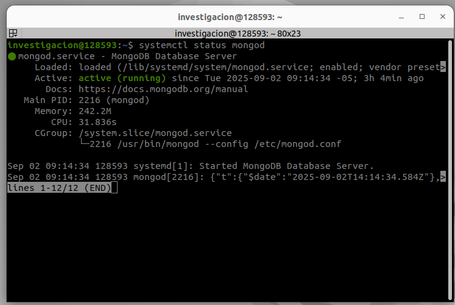
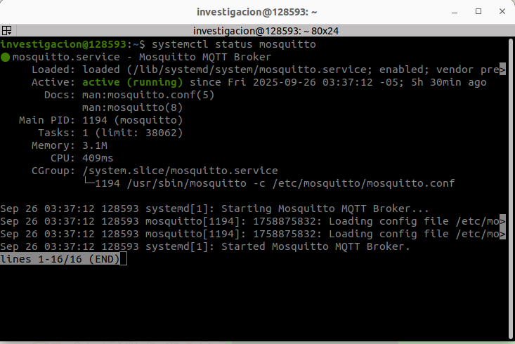
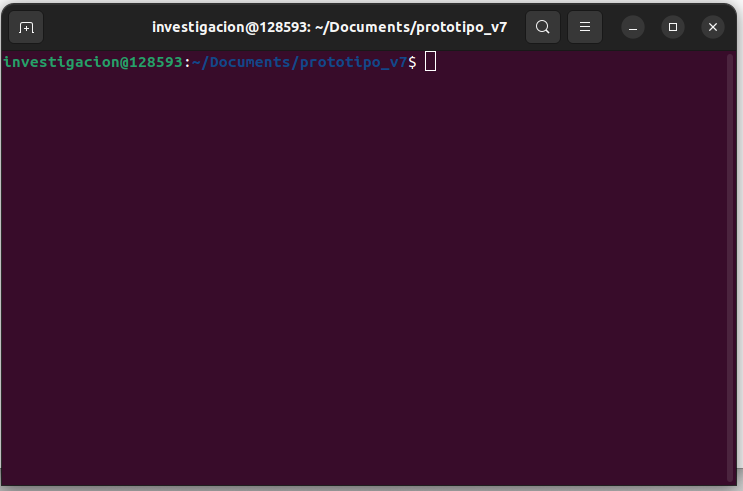
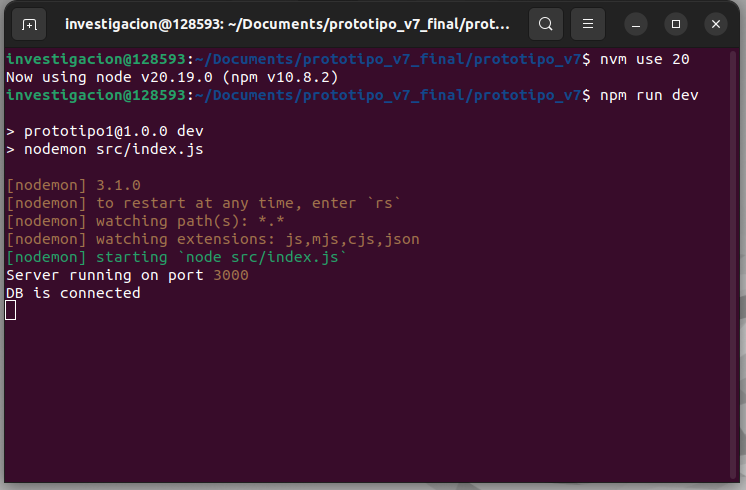

# Seguridad Funcional

## ⚙️ Requisitos previos  

Antes de ejecutar el prototipo, asegúrate de cumplir con lo siguiente:

1. **Descargar la carpeta correspondiente a `prototipo_v7`**  
   ```bash
   
   git clone --no-checkout https://github.com/Sergio-Castano/manuales-apps-industriales-GITCoD.git
   cd manuales-apps-industriales-GITCoD
   git sparse-checkout init --cone
   git sparse-checkout set Seguridad_Funcional/prototipo_v7_final/prototipo_v7
   git checkout

   ```
2. Tener instalado **Mosquitto**, **Node.js** y **MongoDB** en tu sistema.  
   - [Descargar Node.js](https://nodejs.org/)
  
   ```bash
     # Download and install nvm:
      curl -o- https://raw.githubusercontent.com/nvm-sh/nvm/v0.40.3/install.sh | bash
      
      # in lieu of restarting the shell
      \. "$HOME/.nvm/nvm.sh"
      
      # Download and install Node.js:
      nvm install 22
      
      # Verify the Node.js version:
      node -v # Should print "v22.20.0".
      
      # Verify npm version:
      npm -v # Should print "10.9.3".
    ```
   - Descargar node red (Tiene como requisito previo a Node JS)
     
     ```bash
     sudo npm install -g --unsafe-perm node-red
     ```
   
      
   - [Instalación de MongoDB](https://www.mongodb.com/docs/manual/installation/)
     
     El primer paso es importar la llave pública del Community Edition:
      ```bash
        sudo apt-get install gnupg curl
         curl -fsSL https://www.mongodb.org/static/pgp/server-8.0.asc | \
         sudo gpg -o /usr/share/keyrings/mongodb-server-8.0.gpg \
         --dearmor
      ```
      
      Siguiente paso es crear la lista, esta varía de acuerdo a la versión de Ubuntu, esta linea de código es para Focal 20.04
       ```bash
         echo "deb [ arch=amd64,arm64 signed-by=/usr/share/keyrings/mongodb-server-8.0.gpg ] https://repo.mongodb.org/apt/ubuntu focal/mongodb-org/8.2 multiverse" | sudo tee /etc/apt/sources.list.d/mongodb-org-8.2.list
       
       ```
       
       Para Jammy 22.04
        ```bash
         echo "deb [ arch=amd64,arm64 signed-by=/usr/share/keyrings/mongodb-server-8.0.gpg ] https://repo.mongodb.org/apt/ubuntu jammy/mongodb-org/8.2 multiverse" | sudo tee /etc/apt/sources.list.d/mongodb-org-8.2.list
       
       ```
  
        Para Noble 24.04
        ```bash
         echo "deb [ arch=amd64,arm64 signed-by=/usr/share/keyrings/mongodb-server-8.0.gpg ] https://repo.mongodb.org/apt/ubuntu noble/mongodb-org/8.2 multiverse" | sudo tee /etc/apt/sources.list.d/mongodb-org-8.2.list
       
       ```
          
       
       El tercer paso es recargar los paquetes con la base de datos
       ```bash
       sudo apt-get update
       ```
       
       Finalmente instalar MongoDB
       ```bash
       sudo apt-get install -y mongodb-org
       ```
       
       Después de instalarlo debemos iniciar el programa
       ```bash
       sudo systemctl start mongod
       ```

       En caso de que recibas un error similar a este "Failed to start mongod.service: Unit mongod.service not found.", primero ejecutar
      ```bash
      sudo systemctl daemon-reload
       ```
       
   
   - Instalación Mosquitto
     ```bash
      sudo apt update
      sudo apt install mosquitto mosquitto-clients
      ```
4. Verificar que **MongoDB y Mosquitto estén corriendo** en tu máquina.  
   El estado debería verse similar a las siguientes imágenes:  

   

   

---

## ▶️ Ejecución del prototipo

1. Dirígete a la carpeta descargada `prototipo_v7`.  
2. Haz **clic derecho** y selecciona **Abrir en Terminal**.  
   La ventana debería abrirse como en la siguiente imagen:  

   

3. En ese terminal, ejecuta los siguientes comandos:  

   ```bash
   nvm use 20
   npm run dev

4. Finalmente debe salir así la terminal

    

5. Para ejecutar el prototipo, ingresamos a nuestro buscador y ejecutamos el puerto

   ```bash
   http://localhost:3000/
   ```


   
