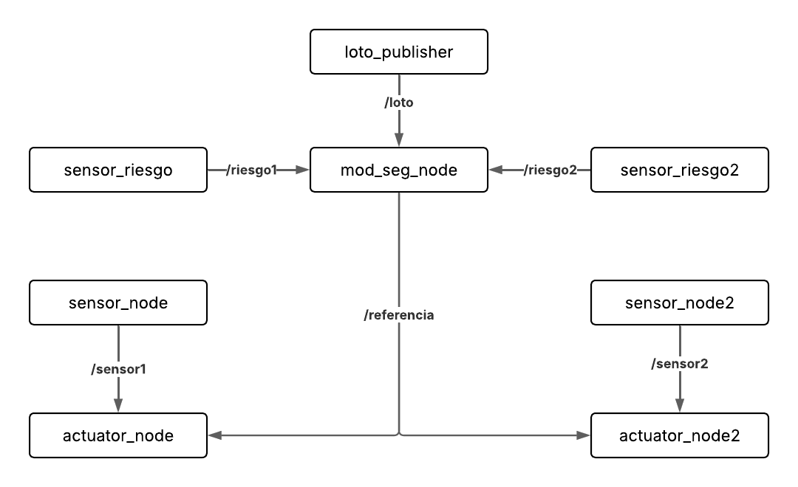

# Proyecto: Sistema de Control Distribuido con Seguridad Funcional sobre Raspberry PLC 19R+ para Centelsa

**Desarrollado por:** Luis Miguel Porras Gaviria  
**Universidad Autónoma de Occidente**  
**Contacto:** lmporras@uao.edu.co

## Descripción del Proyecto

Este proyecto se centra en la implementación de un sistema de control distribuido utilizando ROS 2, enfocado en **seguridad funcional** y ejecutado en un **Raspberry PLC 19R+**. El sistema gestiona nodos de sensores, actuadores y módulos de referencia adaptativa (MOD), los cuales ajustan dinámicamente las señales de control basándose en los **factores de riesgo** del entorno.

El objetivo principal es tener un sistema capaz de tomar decisiones operativas de forma segura frente a situaciones de riesgo, aplicando el protocolo **LOTO (Lock-Out/Tag-Out)** para validación y seguridad. Además, el proyecto utiliza **Singularity** para ejecutar múltiples contenedores, garantizando una correcta **sincronización en tiempo real** y **gestión de prioridades**.

### Características Claves:
- **ROS 2** para control distribuido.
- **Seguridad Funcional** mediante gestión de riesgos y control en tiempo real.
- **MQTT** para publicaciones desde el nodo LOTO.
- Implementación sobre **Raspberry PLC 19R+** con contenedores Singularity para optimización.
- Arquitectura distribuida para manejo de sensores y actuadores.

## Objetivos

- Diseñar un sistema que integre **estrategias de seguridad funcional**.
- Mejorar la **eficiencia** en la gestión de seguridad en entornos industriales como el de **Centelsa**.
- Desarrollar un sistema **dinámico y proactivo** frente a factores de riesgo.

## Metodología

El sistema fue desarrollado sobre un **Raspberry PLC 19R+**, elegido por su flexibilidad y soporte de código abierto, lo cual elimina la necesidad de licencias propietarias. Se utilizó **Singularity** para crear contenedores y gestionar la ejecución de procesos, lo que ayuda a cumplir con los estrictos requisitos de **seguridad funcional**.

El sistema se estructura de la siguiente manera:

- **Nodos de Sensores**: Monitorean parámetros de riesgo y otros factores de seguridad.
- **Nodo MOD**: Regula la referencia de control en función de los datos de riesgo.
- **Nodo LOTO**: Controla la activación y validación del sistema según el estado de seguridad.

Además, se configura **sincronización precisa** y **gestión de prioridades en tiempo real** utilizando técnicas como `SCHED_FIFO`, `mlockall`, y asignación explícita de **núcleos de CPU**.

## Diagrama de Nodos

A continuación, se presenta el diagrama de nodos que ilustra cómo interactúan los diferentes módulos del sistema:



Este diagrama muestra cómo los nodos de sensores, actuadores, y el nodo de referencia se comunican y se gestionan en tiempo real dentro del sistema. 

## Resultados y Códigos 

El sistema fue probado en ejecución simultánea de múltiples nodos dentro de contenedores Singularity, manteniendo tiempos de **muestra estables** y latencias mínimas, incluso en condiciones críticas. Se realizaron pruebas con **sensores** y **actuadores**, mostrando una **sincronización confiable** y un control eficiente bajo diversas condiciones de carga.

### Ejemplos de Resultados:
- **Tiempos de Muestreo**: Los nodos de sensores mantuvieron un periodo constante de 50 ms, con una **dispersión mínima**.
- **Tiempos de Ejecución**: Los nodos de control, como `actuator_node`, mostraron tiempos de ejecución promedio entre 11 y 36 ms, sin generar latencias críticas.
- **Publicación LOTO**: El nodo `loto_publisher` logró tiempos de ejecución por debajo de 0.3 ms, sin afectar la reactividad del sistema.

A continuación están los códigos junto a la ejecución de los mismos mediante singularity:
1. Ingresar al PLC mediante SSH o una pantalla con micro HDMI
2. Ingresar al contenedor de Singularity con los siguientes comandos
   
   ```bash
   cd singularity_containers/
   sudo singularity shell -w ROS2/
   ```
3. Dentro de Singularity debemos ejecutar estos comandos

    ```bash
   cd ..
   cd ros2_ws/
   source install/setup.bash
   source /opt/ros/humble/setup.bash
   ```
   En caso de no encontrar los ejecutables a momento de usarlos, utilizar: 

    ```bash
   colcon build --packages-select loto_sender_pkg sensor_node2 sensor_node mod_seg_pkg
   ```
    
    Y después ejecutar

   ```bash
   source install/setup.bash
   source /opt/ros/humble/setup.bash
   ```
   
4. Repetir este proceso 9 veces en total con cada uno de los siguientes códigos
   A. Nodo del Actuador 1
   ```bash
   #include <rclcpp/rclcpp.hpp>
   #include "std_msgs/msg/float64.hpp"
   #include <cstdlib>
   #include <string>
   #include <memory>
   #include <sstream>
   #include <algorithm>
   #include <vector>
   #include <ctime>
   #include <csignal>
   #include <iostream>
   #include <pthread.h>
   #include <sched.h>
   #include <unistd.h>
   #include <sys/mman.h>
   
   bool continuar = true;
   
   void signal_handler(int signum) {
       continuar = false;
   }
   
   class ActuatorNode : public rclcpp::Node
   {
   public:
       ActuatorNode() : Node("actuator_node"), reference_(0.0), error_prev_(0.0), integral_(0.0),
                        Kp_(1.0), Ki_(0.1), Kd_(0.05)
       {
           sensor_subscription_ = this->create_subscription<std_msgs::msg::Float64>(
               "sensor_data", 10,
               std::bind(&ActuatorNode::sensor_callback, this, std::placeholders::_1));
   
           reference_subscription_ = this->create_subscription<std_msgs::msg::Float64>(
               "reference", 10,
               std::bind(&ActuatorNode::reference_callback, this, std::placeholders::_1));
   
           rclcpp::on_shutdown([this]() {
               stop_motor();
           });
   
           last_activation_time_ = {0, 0};
           last_write_time_ = {0, 0};
       }
   
       std::vector<double> tiempos_control;
       std::vector<double> periodos;
   
   private:
       void sensor_callback(const std_msgs::msg::Float64::SharedPtr msg)
       {
           struct timespec t0, t1;
           clock_gettime(CLOCK_MONOTONIC, &t0);
   
           if (last_activation_time_.tv_sec != 0 || last_activation_time_.tv_nsec != 0) {
               double periodo = (t0.tv_sec - last_activation_time_.tv_sec) +
                                (t0.tv_nsec - last_activation_time_.tv_nsec) / 1e9;
               periodos.push_back(periodo);
           }
           last_activation_time_ = t0;
   
           double sensor = msg->data;
           double error = reference_ - sensor;
           integral_ += error;
           integral_ = std::clamp(integral_, -50.0, 50.0);
           double derivative = error - error_prev_;
           double output = Kp_ * error + Ki_ * integral_ + Kd_ * derivative;
           output = std::clamp(output, 0.0, 5.0);
   
           int dac_value = static_cast<int>((output / 10.0) * 4095.0);
           dac_value = std::clamp(dac_value, 0, 4095);
   
           double dt = (t0.tv_sec - last_write_time_.tv_sec) +
                       (t0.tv_nsec - last_write_time_.tv_nsec) / 1e9;
   
           if (dt >= 0.050) {
               std::ostringstream cmd;
               cmd << "/set-analog-output A0.2 " << dac_value;
   
               FILE *pipe = popen(cmd.str().c_str(), "r");
               if (pipe) pclose(pipe);
   
               last_write_time_ = t0;
           }
   
           error_prev_ = error;
   
           clock_gettime(CLOCK_MONOTONIC, &t1);
           double elapsed = (t1.tv_sec - t0.tv_sec) + (t1.tv_nsec - t0.tv_nsec) / 1e9;
           tiempos_control.push_back(elapsed);
       }
   
       void reference_callback(const std_msgs::msg::Float64::SharedPtr msg)
       {
           reference_ = msg->data;
       }
   
       void stop_motor()
       {
           std::system("/set-analog-output A0.2 0");
           std::cout << "⚠️  Nodo detenido: salida A0.2 puesta en 0." << std::endl;
       }
   
       rclcpp::Subscription<std_msgs::msg::Float64>::SharedPtr sensor_subscription_;
       rclcpp::Subscription<std_msgs::msg::Float64>::SharedPtr reference_subscription_;
       double reference_, error_prev_, integral_;
       double Kp_, Ki_, Kd_;
       struct timespec last_activation_time_;
       struct timespec last_write_time_;
   };
   
   int main(int argc, char *argv[])
   {
       std::signal(SIGINT, signal_handler);
       rclcpp::init(argc, argv);
   
       // ✅ Evita page faults
       if (mlockall(MCL_CURRENT | MCL_FUTURE) != 0) {
           std::cerr << "⚠️  No se pudo bloquear la memoria RAM." << std::endl;
       }
   
       // ✅ Prioridad tiempo real 81
       struct sched_param param;
       param.sched_priority = 81;
       if (pthread_setschedparam(pthread_self(), SCHED_FIFO, &param) != 0) {
           std::cerr << "⚠️  No se pudo asignar prioridad tiempo real." << std::endl;
       }
   
       // ✅ Afinidad a núcleo 2
       cpu_set_t cpuset;
       CPU_ZERO(&cpuset);
       CPU_SET(2, &cpuset);
       if (pthread_setaffinity_np(pthread_self(), sizeof(cpu_set_t), &cpuset) != 0) {
           std::cerr << "⚠️  No se pudo fijar la afinidad al CPU 2." << std::endl;
       }
   
       auto node = std::make_shared<ActuatorNode>();
   
       struct timespec sleep_time = {0, 500};  // 0.5 microsegundos
   
       while (rclcpp::ok() && continuar) {
           rclcpp::spin_some(node);
           clock_nanosleep(CLOCK_MONOTONIC, 0, &sleep_time, nullptr);
       }
   
       rclcpp::shutdown();
   
       std::cout << "\n📈 Tiempos de ejecución del control (s):\n[";
       for (size_t i = 0; i < node->tiempos_control.size(); ++i) {
           std::cout << node->tiempos_control[i];
           if (i != node->tiempos_control.size() - 1) std::cout << ", ";
       }
       std::cout << "]" << std::endl;
   
       std::cout << "\n📊 Períodos entre tareas de control (s):\n[";
       for (size_t i = 0; i < node->periodos.size(); ++i) {
           std::cout << node->periodos[i];
           if (i != node->periodos.size() - 1) std::cout << ", ";
       }
       std::cout << "]" << std::endl;
   
       return 0;
   }
   ```
   
   Ejecución y nombre del código: 
   ```bash
   ros2 run sensor_node actuator_node
   ```
   B. Nodo del sensor 1

   ```bash
   #include <rclcpp/rclcpp.hpp>
   #include "std_msgs/msg/float64.hpp"
   #include <cstdlib>
   #include <string>
   #include <memory>
   #include <array>
   #include <sstream>
   #include <vector>
   #include <ctime>
   #include <csignal>
   #include <iostream>
   #include <pthread.h>
   #include <sched.h>
   #include <unistd.h>
   #include <sys/mman.h>
   
   using std::placeholders::_1;
   
   bool continuar = true;
   bool ignorar_delta = false;
   
   void signal_handler(int) {
       std::cout << "🔴 Señal SIGINT recibida. Cerrando nodo sensor..." << std::endl;
       continuar = false;  // 🚫 Detener el ciclo, pero no hacer shutdown aquí
   }
   
   struct timespec AddTimespecByNs(struct timespec ts, int64_t ns)
   {
       ts.tv_nsec += ns;
       while (ts.tv_nsec >= 1000000000) {
           ++ts.tv_sec;
           ts.tv_nsec -= 1000000000;
       }
       while (ts.tv_nsec < 0) {
           --ts.tv_sec;
           ts.tv_nsec += 1000000000;
       }
       return ts;
   }
   
   class SensorNode : public rclcpp::Node
   {
   public:
       SensorNode() : Node("sensor_node")
       {
           publisher_ = this->create_publisher<std_msgs::msg::Float64>("sensor_data", 10);
           sub_loto_ = this->create_subscription<std_msgs::msg::Float64>(
               "loto", 10, std::bind(&SensorNode::loto_callback, this, _1));
           last_time = {0, 0};
           std::cout << "✅ Nodo sensor_node iniciado correctamente." << std::endl;
       }
   
       void read_sensor()
       {
           struct timespec now;
           clock_gettime(CLOCK_MONOTONIC, &now);
   
           if (!ignorar_delta && (last_time.tv_sec != 0 || last_time.tv_nsec != 0)) {
               double delta = (now.tv_sec - last_time.tv_sec) +
                              (now.tv_nsec - last_time.tv_nsec) / 1e9;
               tiempos.push_back(delta);
           }
           ignorar_delta = false;
           last_time = now;
   
           std::string output = exec("/get-analog-input I0.4");
           try {
               double bin = std::stod(output);
               double voltage = (bin / 4095.0) * 10.0;
   
               auto msg = std_msgs::msg::Float64();
               msg.data = voltage;
               publisher_->publish(msg);
   
               RCLCPP_INFO(this->get_logger(), "Sensor I0.4: %f V", voltage);
           }
           catch (const std::exception &e) {
               RCLCPP_ERROR(this->get_logger(), "Error leyendo o convirtiendo: '%s'", output.c_str());
           }
       }
   
       std::vector<double> tiempos;
       struct timespec next_wakeup;
   
   private:
       std::string exec(const char* cmd)
       {
           std::array<char, 128> buffer;
           std::string result;
           std::shared_ptr<FILE> pipe(popen(cmd, "r"), pclose);
           if (!pipe) throw std::runtime_error("popen() falló");
           while (fgets(buffer.data(), buffer.size(), pipe.get()) != nullptr) {
               result += buffer.data();
           }
           return result;
       }
   
       void loto_callback(const std_msgs::msg::Float64::SharedPtr msg) {
           double nuevo = msg->data;
           if (loto_anterior_ == 0.0 && nuevo == 1.0) {
               std::cout << "🔄 LOTO flanco 0→1 detectado. Reiniciando tiempo de muestreo." << std::endl;
               clock_gettime(CLOCK_MONOTONIC, &next_wakeup);
               ignorar_delta = true;
           }
           loto_anterior_ = nuevo;
       }
   
       rclcpp::Publisher<std_msgs::msg::Float64>::SharedPtr publisher_;
       rclcpp::Subscription<std_msgs::msg::Float64>::SharedPtr sub_loto_;
       struct timespec last_time;
       double loto_anterior_ = 1.0;
   };
   
   int main(int argc, char ** argv)
   {
       std::signal(SIGINT, signal_handler);
       rclcpp::init(argc, argv);
   
       if (mlockall(MCL_CURRENT | MCL_FUTURE) != 0) {
           std::cerr << "⚠️  No se pudo bloquear memoria con mlockall." << std::endl;
       }
   
       struct sched_param param;
       param.sched_priority = 85;
       cpu_set_t cpuset;
       CPU_ZERO(&cpuset);
       CPU_SET(2, &cpuset);  // Core 2
   
       pthread_setschedparam(pthread_self(), SCHED_FIFO, &param);
       pthread_setaffinity_np(pthread_self(), sizeof(cpu_set_t), &cpuset);
   
       auto node = std::make_shared<SensorNode>();
   
       clock_gettime(CLOCK_MONOTONIC, &node->next_wakeup);
       const int64_t periodo_ns = 50 * 1e6;  // 50 ms
   
       while (rclcpp::ok() && continuar) {
           node->read_sensor();
           rclcpp::spin_some(node);
           node->next_wakeup = AddTimespecByNs(node->next_wakeup, periodo_ns);
           clock_nanosleep(CLOCK_MONOTONIC, TIMER_ABSTIME, &node->next_wakeup, nullptr);
       }
   
       std::cout << "\n📈 Tiempos entre llamadas a read_sensor (s):\n[";
       for (size_t i = 0; i < node->tiempos.size(); ++i) {
           std::cout << node->tiempos[i];
           if (i != node->tiempos.size() - 1)
               std::cout << ", ";
       }
       std::cout << "]" << std::endl;
   
       rclcpp::shutdown();  // ✅ shutdown seguro al final
       return 0;
   }
   ```

   Ejecución y nombre del código: 
   ```bash
   ros2 run sensor_node sensor_node
   ```
   
   C. Nodo del sensor de riesgo 1 


   ```bash                                                                                                                                                                                                                                                                
   #include <rclcpp/rclcpp.hpp>
   #include "std_msgs/msg/float64.hpp"
   #include <cstdlib>
   #include <string>
   #include <memory>
   #include <iostream>
   #include <vector>
   #include <ctime>
   #include <csignal>
   #include <pthread.h>
   #include <sched.h>
   #include <unistd.h>
   #include <sys/mman.h>
   
   bool continuar = true;
   
   void signal_handler(int signum) {
       std::cout << "🔴 Señal SIGINT recibida. Cerrando nodo sensor_riesgo..." << std::endl;
       continuar = false;
       rclcpp::shutdown();
   }
   
   class SensorRiesgo : public rclcpp::Node
   {
   public:
       SensorRiesgo() : Node("sensor_riesgo")
       {
           publisher_ = this->create_publisher<std_msgs::msg::Float64>("riesgo_1", 10);
           last_time_ = {0, 0};
           std::cout << "✅ Nodo sensor_riesgo iniciado correctamente." << std::endl;
       }
   
       void read_sensor()
       {
           struct timespec now;
           clock_gettime(CLOCK_MONOTONIC, &now);
   
           if (last_time_.tv_sec != 0 || last_time_.tv_nsec != 0) {
               double delta = (now.tv_sec - last_time_.tv_sec) +
                              (now.tv_nsec - last_time_.tv_nsec) / 1e9;
               tiempos.push_back(delta);
           }
   
           last_time_ = now;
   
           std::string output = exec("/get-analog-input I0.2");
   
           try {
               double bin = std::stod(output);
               double voltage = (bin / 4095.0) * 10.0;
   
               auto msg = std_msgs::msg::Float64();
               msg.data = voltage;
               publisher_->publish(msg);
   
               std::cout << "[riesgo_1] I0.2 = " << voltage << " V" << std::endl;
           } catch (const std::exception &e) {
               std::cerr << "❌ Error leyendo I0.2: '" << output << "'" << std::endl;
           }
       }
   
       std::vector<double> tiempos;
   
   private:
       std::string exec(const char *cmd)
       {
           char buffer[128];
           std::string result;
           FILE *fp = popen(cmd, "r");
           if (!fp) return "0";
           while (fgets(buffer, sizeof(buffer), fp)) result += buffer;
           fclose(fp);
           return result;
       }
   
       rclcpp::Publisher<std_msgs::msg::Float64>::SharedPtr publisher_;
       struct timespec last_time_;
   };
   
   int main(int argc, char **argv)
   {
       std::signal(SIGINT, signal_handler);
       rclcpp::init(argc, argv);
   
       // ✅ Evitar fallos de página
       if (mlockall(MCL_CURRENT | MCL_FUTURE) != 0) {
           std::cerr << "⚠️  No se pudo bloquear la memoria RAM." << std::endl;
       }
   
       // ✅ Prioridad tiempo real 83
       struct sched_param param;
       param.sched_priority = 83;
       if (pthread_setschedparam(pthread_self(), SCHED_FIFO, &param) != 0) {
           std::cerr << "⚠️  No se pudo asignar prioridad tiempo real." << std::endl;
       }
   
       // ✅ Afinidad al core 2
       cpu_set_t cpuset;
       CPU_ZERO(&cpuset);
       CPU_SET(2, &cpuset);
       if (pthread_setaffinity_np(pthread_self(), sizeof(cpu_set_t), &cpuset) != 0) {
           std::cerr << "⚠️  No se pudo fijar la afinidad al CPU 2." << std::endl;
       }
   
       auto node = std::make_shared<SensorRiesgo>();
   
       // ✅ Temporización precisa (wake-up absoluto cada 50 ms)
       struct timespec next_wakeup;
       clock_gettime(CLOCK_MONOTONIC, &next_wakeup);
   
       while (rclcpp::ok() && continuar) {
           rclcpp::spin_some(node);
           node->read_sensor();
   
           // Siguiente wake-up: +50 ms
           next_wakeup.tv_nsec += 50 * 1e6;
           while (next_wakeup.tv_nsec >= 1e9) {
               next_wakeup.tv_nsec -= 1e9;
               next_wakeup.tv_sec++;
           }
           clock_nanosleep(CLOCK_MONOTONIC, TIMER_ABSTIME, &next_wakeup, nullptr);
       }
   
       std::cout << "\n📈 Tiempos entre llamadas a read_sensor (s):\n[";
       for (size_t i = 0; i < node->tiempos.size(); ++i) {
           std::cout << node->tiempos[i];
           if (i != node->tiempos.size() - 1)
               std::cout << ", ";
       }
       std::cout << "]" << std::endl;
   
       return 0;
   }
   ```

   Ejecución y nombre del código: 
   ```bash
   ros2 run sensor_node sensor_riesgo
   ```

   D. Nodo del actuador 2
   
   ```bash
   #include <rclcpp/rclcpp.hpp>
   #include "std_msgs/msg/float64.hpp"
   #include <cstdlib>
   #include <string>
   #include <memory>
   #include <sstream>
   #include <algorithm>
   #include <iostream>
   #include <vector>
   #include <ctime>
   #include <csignal>
   #include <pthread.h>
   #include <sched.h>
   #include <unistd.h>
   #include <sys/mman.h>
   
   bool continuar = true;
   
   void signal_handler(int signum) {
       std::cout << "🔴 Señal SIGINT recibida. Cerrando actuator_node2..." << std::endl;
       continuar = false;
       rclcpp::shutdown();
   }
   
   class ActuatorNode2 : public rclcpp::Node
   {
   public:
       ActuatorNode2() : Node("actuator_node2"), reference_(0.0), error_prev_(0.0), integral_(0.0),
                         Kp_(1.0), Ki_(0.1), Kd_(0.05)
       {
           sensor_subscription_ = this->create_subscription<std_msgs::msg::Float64>(
               "sensor_data2", 10,
               std::bind(&ActuatorNode2::sensor_callback, this, std::placeholders::_1));
   
           reference_subscription_ = this->create_subscription<std_msgs::msg::Float64>(
               "reference2", 10,
               std::bind(&ActuatorNode2::reference_callback, this, std::placeholders::_1));
   
           rclcpp::on_shutdown([this]() {
               stop_motor();
           });
   
           last_activation_time_ = {0, 0};
           last_output_time_ = {0, 0};
       }
   
       std::vector<double> tiempos_control;
       std::vector<double> periodos;
   
   private:
       void sensor_callback(const std_msgs::msg::Float64::SharedPtr msg)
       {
           struct timespec t0, t1;
           clock_gettime(CLOCK_MONOTONIC, &t0);
   
           if (last_activation_time_.tv_sec != 0 || last_activation_time_.tv_nsec != 0) {
               double periodo = (t0.tv_sec - last_activation_time_.tv_sec) +
                                (t0.tv_nsec - last_activation_time_.tv_nsec) / 1e9;
               periodos.push_back(periodo);
           }
           last_activation_time_ = t0;
   
           double sensor = msg->data;
           double error = reference_ - sensor;
   
           integral_ += error;
           integral_ = std::clamp(integral_, -100.0, 100.0);
   
           double derivative = error - error_prev_;
           double output = Kp_ * error + Ki_ * integral_ + Kd_ * derivative;
   
           output = std::clamp(output, 0.0, 5.0);
           int dac_value = static_cast<int>((output / 10.0) * 4095.0);
           dac_value = std::clamp(dac_value, 0, 4095);
   
           struct timespec now;
           clock_gettime(CLOCK_MONOTONIC, &now);
           double delta = (now.tv_sec - last_output_time_.tv_sec) +
                          (now.tv_nsec - last_output_time_.tv_nsec) / 1e9;
   
           if (delta > 0.05) {
               std::ostringstream cmd;
               cmd << "/set-analog-output A0.1 " << dac_value;
               std::system(cmd.str().c_str());
               last_output_time_ = now;
           }
   
           error_prev_ = error;
   
           clock_gettime(CLOCK_MONOTONIC, &t1);
           double elapsed = (t1.tv_sec - t0.tv_sec) + (t1.tv_nsec - t0.tv_nsec) / 1e9;
           tiempos_control.push_back(elapsed);
       }
   
       void reference_callback(const std_msgs::msg::Float64::SharedPtr msg)
       {
           reference_ = msg->data;
       }
   
       void stop_motor()
       {
           std::system("/set-analog-output A0.1 0");
           std::cout << "⚠️  Nodo actuator_node2 detenido: salida A0.1 puesta en 0." << std::endl;
       }
   
       rclcpp::Subscription<std_msgs::msg::Float64>::SharedPtr sensor_subscription_;
       rclcpp::Subscription<std_msgs::msg::Float64>::SharedPtr reference_subscription_;
       double reference_, error_prev_, integral_;
       double Kp_, Ki_, Kd_;
       struct timespec last_activation_time_;
       struct timespec last_output_time_;
   };
   
   int main(int argc, char *argv[])
   {
       std::signal(SIGINT, signal_handler);
       rclcpp::init(argc, argv);
   
       if (mlockall(MCL_CURRENT | MCL_FUTURE) != 0) {
           std::cerr << "⚠️  No se pudo bloquear memoria con mlockall()." << std::endl;
       }
   
       struct sched_param param;
       param.sched_priority = 80;
       if (pthread_setschedparam(pthread_self(), SCHED_FIFO, &param) != 0) {
           std::cerr << "⚠️  No se pudo establecer prioridad tiempo real." << std::endl;
       }
   
       cpu_set_t cpuset;
       CPU_ZERO(&cpuset);
       CPU_SET(3, &cpuset);
       if (pthread_setaffinity_np(pthread_self(), sizeof(cpu_set_t), &cpuset) != 0) {
           std::cerr << "⚠️  No se pudo fijar afinidad al core 3." << std::endl;
       }
   
       auto node = std::make_shared<ActuatorNode2>();
   
       struct timespec sleep_time = {0, 500};  // 🔁 0.5 microsegundos
   
       while (rclcpp::ok() && continuar) {
           rclcpp::spin_some(node);
           clock_nanosleep(CLOCK_MONOTONIC, 0, &sleep_time, nullptr);
       }
   
       std::cout << "\n📈 Tiempos de ejecución del control (s):\n[";
       for (size_t i = 0; i < node->tiempos_control.size(); ++i) {
           std::cout << node->tiempos_control[i];
           if (i != node->tiempos_control.size() - 1) std::cout << ", ";
       }
       std::cout << "]" << std::endl;
   
       std::cout << "\n📊 Períodos entre tareas de control (s):\n[";
       for (size_t i = 0; i < node->periodos.size(); ++i) {
           std::cout << node->periodos[i];
           if (i != node->periodos.size() - 1) std::cout << ", ";
       }
       std::cout << "]" << std::endl;
   
       return 0;
   }
   ```

   Ejecución y nombre del código: 
   ```bash
   ros2 run sensor_node2 actuator_node2
   ```
   
   E. Nodo del sensor 2
    
   ```bash
   #include <rclcpp/rclcpp.hpp>
   #include "std_msgs/msg/float64.hpp"
   #include <cstdlib>
   #include <string>
   #include <memory>
   #include <array>
   #include <sstream>
   #include <vector>
   #include <ctime>
   #include <csignal>
   #include <iostream>
   #include <pthread.h>
   #include <sched.h>
   #include <unistd.h>
   #include <sys/mman.h>
   
   bool continuar = true;
   
   void signal_handler(int) {
       std::cout << "🔴 Señal SIGINT recibida. Cerrando sensor_node2..." << std::endl;
       continuar = false;
   }
   
   struct timespec AddTimespecByNs(struct timespec ts, int64_t ns)
   {
       ts.tv_nsec += ns;
       while (ts.tv_nsec >= 1000000000) {
           ++ts.tv_sec;
           ts.tv_nsec -= 1000000000;
       }
       while (ts.tv_nsec < 0) {
           --ts.tv_sec;
           ts.tv_nsec += 1000000000;
       }
       return ts;
   }
   
   class SensorNode2 : public rclcpp::Node
   {
   public:
       SensorNode2() : Node("sensor_node2")
       {
           publisher_ = this->create_publisher<std_msgs::msg::Float64>("sensor_data2", 10);
           last_time = {0, 0};
           std::cout << "✅ Nodo sensor_node2 iniciado correctamente." << std::endl;
       }
   
       void read_sensor()
       {
           struct timespec now;
           clock_gettime(CLOCK_MONOTONIC, &now);
   
           if (last_time.tv_sec != 0 || last_time.tv_nsec != 0) {
               double delta = (now.tv_sec - last_time.tv_sec) +
                              (now.tv_nsec - last_time.tv_nsec) / 1e9;
               tiempos.push_back(delta);
           }
   
           last_time = now;
   
           std::string output = exec("/get-analog-input I0.3");
           try {
               double bin = std::stod(output);
               double voltage = (bin / 4095.0) * 10.0;
   
               auto msg = std_msgs::msg::Float64();
               msg.data = voltage;
               publisher_->publish(msg);
   
               RCLCPP_INFO(this->get_logger(), "Sensor I0.3: %f V", voltage);
           }
           catch (const std::exception &e) {
               RCLCPP_ERROR(this->get_logger(), "Error leyendo o convirtiendo: '%s'", output.c_str());
           }
       }
   
       std::vector<double> tiempos;
   
   private:
       std::string exec(const char* cmd)
       {
           std::array<char, 128> buffer;
           std::string result;
           std::shared_ptr<FILE> pipe(popen(cmd, "r"), pclose);
           if (!pipe) throw std::runtime_error("popen() falló");
           while (fgets(buffer.data(), buffer.size(), pipe.get()) != nullptr) {
               result += buffer.data();
           }
           return result;
       }
   
       rclcpp::Publisher<std_msgs::msg::Float64>::SharedPtr publisher_;
       struct timespec last_time;
   };
   
   int main(int argc, char ** argv)
   {
       std::signal(SIGINT, signal_handler);
       rclcpp::init(argc, argv);
   
       if (mlockall(MCL_CURRENT | MCL_FUTURE) != 0) {
           std::cerr << "⚠️  No se pudo bloquear la memoria." << std::endl;
       }
   
       struct sched_param param;
       param.sched_priority = 84;
       pthread_setschedparam(pthread_self(), SCHED_FIFO, &param);
   
       cpu_set_t cpuset;
       CPU_ZERO(&cpuset);
       CPU_SET(3, &cpuset);
       pthread_setaffinity_np(pthread_self(), sizeof(cpu_set_t), &cpuset);
   
       auto node = std::make_shared<SensorNode2>();
   
       struct timespec next_wakeup;
       clock_gettime(CLOCK_MONOTONIC, &next_wakeup);
       const int64_t periodo_ns = 50 * 1e6;
   
       while (rclcpp::ok() && continuar) {
           try {
               node->read_sensor();
               if (!continuar) break;  // ⚠️ Protección extra antes de spin_some
               rclcpp::spin_some(node);
           } catch (const rclcpp::exceptions::RCLError &e) {
               std::cerr << "❌ Excepción capturada: " << e.what() << std::endl;
               break;
           }
           next_wakeup = AddTimespecByNs(next_wakeup, periodo_ns);
           clock_nanosleep(CLOCK_MONOTONIC, TIMER_ABSTIME, &next_wakeup, nullptr);
       }
   
       std::cout << "\n📈 Tiempos entre llamadas a read_sensor (s):\n[";
       for (size_t i = 0; i < node->tiempos.size(); ++i) {
           std::cout << node->tiempos[i];
           if (i != node->tiempos.size() - 1)
               std::cout << ", ";
       }
       std::cout << "]" << std::endl;
   
       rclcpp::shutdown();  // ✅ shutdown al final
       return 0;
   }
   ```

   Ejecución y nombre del código:
   
   ```bash
   ros2 run sensor_node2 sensor_node2
   ```

   F. Nodo del sensor de riesgo

   ```bash
   #include <rclcpp/rclcpp.hpp>
   #include "std_msgs/msg/float64.hpp"
   #include <cstdlib>
   #include <string>
   #include <memory>
   #include <iostream>
   #include <vector>
   #include <ctime>
   #include <csignal>
   #include <pthread.h>
   #include <sched.h>
   #include <unistd.h>
   #include <chrono>
   #include <thread>
   #include <sys/mman.h>
   
   bool continuar = true;
   
   void signal_handler(int signum) {
       std::cout << "🔴 Señal SIGINT recibida. Cerrando sensor_riesgo2..." << std::endl;
       continuar = false;
       rclcpp::shutdown();
   }
   
   class SensorRiesgo2 : public rclcpp::Node
   {
   public:
       SensorRiesgo2() : Node("sensor_riesgo2")
       {
           publisher_ = this->create_publisher<std_msgs::msg::Float64>("riesgo_2", 10);
           last_time_ = {0, 0};
           std::cout << "✅ Nodo sensor_riesgo2 iniciado correctamente." << std::endl;
       }
   
       std::vector<double> tiempos;
   
       void read_sensor()
       {
           struct timespec now;
           clock_gettime(CLOCK_MONOTONIC, &now);
   
           if (last_time_.tv_sec != 0 || last_time_.tv_nsec != 0) {
               double delta = (now.tv_sec - last_time_.tv_sec) +
                              (now.tv_nsec - last_time_.tv_nsec) / 1e9;
               tiempos.push_back(delta);
           }
   
           last_time_ = now;
   
           std::string output = exec("/get-analog-input I0.5");
   
           try {
               double bin = std::stod(output);
               double voltage = (bin / 4095.0) * 10.0;
   
               auto msg = std_msgs::msg::Float64();
               msg.data = voltage;
               publisher_->publish(msg);
   
               std::cout << "[riesgo_2] I0.5 = " << voltage << " V" << std::endl;
           } catch (const std::exception &e) {
               std::cerr << "❌ Error leyendo I0.5: '" << output << "'" << std::endl;
           }
       }
   
   private:
       std::string exec(const char *cmd)
       {
           char buffer[128];
           std::string result;
           FILE *fp = popen(cmd, "r");
           if (!fp) return "0";
           while (fgets(buffer, sizeof(buffer), fp)) result += buffer;
           fclose(fp);
           return result;
       }
   
       rclcpp::Publisher<std_msgs::msg::Float64>::SharedPtr publisher_;
       struct timespec last_time_;
   };
   
   int main(int argc, char **argv)
   {
       std::signal(SIGINT, signal_handler);
       rclcpp::init(argc, argv);
   
       // 💾 Bloquear memoria
       if (mlockall(MCL_CURRENT | MCL_FUTURE) != 0) {
           std::cerr << "⚠️  No se pudo bloquear la memoria." << std::endl;
       }
   
       // 🧠 Prioridad tiempo real
       struct sched_param param;
       param.sched_priority = 82;
       if (pthread_setschedparam(pthread_self(), SCHED_FIFO, &param) != 0) {
           std::cerr << "⚠️  No se pudo asignar prioridad tiempo real." << std::endl;
       }
   
       // ⚙️ Afinidad a Core 3
       cpu_set_t cpuset;
       CPU_ZERO(&cpuset);
       CPU_SET(3, &cpuset);
       if (pthread_setaffinity_np(pthread_self(), sizeof(cpu_set_t), &cpuset) != 0) {
           std::cerr << "⚠️  No se pudo fijar la afinidad al CPU 3." << std::endl;
       }
   
       auto node = std::make_shared<SensorRiesgo2>();
   
       // ⏱️ Wake-up absoluto cada 50 ms
       struct timespec next_wakeup;
       clock_gettime(CLOCK_MONOTONIC, &next_wakeup);
   
       while (rclcpp::ok() && continuar) {
           rclcpp::spin_some(node);
           node->read_sensor();
   
           next_wakeup.tv_nsec += 50 * 1e6;
           while (next_wakeup.tv_nsec >= 1e9) {
               next_wakeup.tv_nsec -= 1e9;
               next_wakeup.tv_sec++;
           }
           clock_nanosleep(CLOCK_MONOTONIC, TIMER_ABSTIME, &next_wakeup, nullptr);
       }
   
       std::cout << "\n📈 Tiempos entre ejecuciones (s):\n[";
       for (size_t i = 0; i < node->tiempos.size(); ++i) {
           std::cout << node->tiempos[i];
           if (i != node->tiempos.size() - 1) std::cout << ", ";
       }
       std::cout << "]" << std::endl;
   
       return 0;
   }
   ```

   Ejecución y nombre del código:
   
   ```bash
   ros2 run sensor_node2 sensor_riesgo2
   ```
   G. Nodo de conexión con el aplicativo web LOTO - Encargado de recibir el "1" o "0" para la referencia
   
   ```bash
   #include <rclcpp/rclcpp.hpp>
   #include "std_msgs/msg/float64.hpp"
   #include <mqtt/async_client.h>
   #include <iostream>
   #include <thread>
   #include <string>
   #include <vector>
   #include <ctime>
   #include <csignal>
   #include <sched.h>
   #include <pthread.h>
   #include <unistd.h>
   #include <sys/mman.h>
   #include <time.h>
   
   const std::string ADDRESS = "tcp://192.168.0.107:1883";
   const std::string CLIENT_ID = "ros2_loto_publisher";
   const std::string TOPIC_MQTT = "/loto_init";
   
   bool continuar = true;
   
   void signal_handler(int signum) {
       continuar = false;
       rclcpp::shutdown();
   }
   
   class LotoPublisher : public rclcpp::Node, public virtual mqtt::callback {
   public:
       LotoPublisher() : Node("loto_publisher"), client_(ADDRESS, CLIENT_ID) {
           publisher_ = this->create_publisher<std_msgs::msg::Float64>("loto", 10);
           std::cout << "✅ Nodo loto_publisher iniciado (MQTT + terminal)." << std::endl;
   
           mqtt::connect_options connOpts;
           client_.set_callback(*this);
           try {
               client_.connect(connOpts)->wait();
               client_.subscribe(TOPIC_MQTT, 1);
               std::cout << "📡 Suscrito a MQTT topic: " << TOPIC_MQTT << std::endl;
           } catch (const mqtt::exception &e) {
               std::cerr << "❌ Error conectando al broker MQTT: " << e.what() << std::endl;
               rclcpp::shutdown();
           }
   
           // Entrada por terminal (en hilo separado)
           input_thread_ = std::thread([this]() {
               while (rclcpp::ok() && continuar) {
                   std::cout << "🔐 Ingrese LOTO (1 para permitir, 0 para detenerlo): ";
                   std::string input;
                   std::getline(std::cin, input);
                   try {
                       double val = std::stod(input);
                       if (val == 0.0 || val == 1.0) {
                           publicar_loto(val);
                       } else {
                           std::cout << "❌ Solo se permite 0 o 1." << std::endl;
                       }
                   } catch (...) {
                       std::cout << "❌ Entrada inválida." << std::endl;
                   }
               }
           });
           input_thread_.detach();
       }
   
       void message_arrived(mqtt::const_message_ptr msg) override {
           try {
               double val = std::stod(msg->to_string());
               if (val == 0.0 || val == 1.0) {
                   publicar_loto(val);
                   std::cout << "📥 MQTT recibido en /loto_init: " << val << std::endl;
               }
           } catch (...) {
               std::cerr << "❌ MQTT recibido inválido: " << msg->to_string() << std::endl;
           }
       }
   
       std::vector<double> tiempos_publicacion;
   
   private:
       void publicar_loto(double val) {
           struct timespec t0, t1;
           clock_gettime(CLOCK_MONOTONIC, &t0);
   
           std_msgs::msg::Float64 msg;
           msg.data = val;
           publisher_->publish(msg);
           std::cout << "📤 Enviado a /loto: " << val << std::endl;
   
           clock_gettime(CLOCK_MONOTONIC, &t1);
           double elapsed = (t1.tv_sec - t0.tv_sec) + (t1.tv_nsec - t0.tv_nsec) / 1e9;
           tiempos_publicacion.push_back(elapsed);
       }
   
       mqtt::async_client client_;
       rclcpp::Publisher<std_msgs::msg::Float64>::SharedPtr publisher_;
       std::thread input_thread_;
   };
   
   int main(int argc, char **argv) {
       std::signal(SIGINT, signal_handler);
       rclcpp::init(argc, argv);
   
       // 💾 Bloquear memoria
       if (mlockall(MCL_CURRENT | MCL_FUTURE) != 0)
           std::cerr << "⚠️  No se pudo bloquear la memoria." << std::endl;
   
       // 🧠 Prioridad tiempo real 78
       struct sched_param param;
       param.sched_priority = 78;
       if (pthread_setschedparam(pthread_self(), SCHED_FIFO, &param) != 0)
           std::cerr << "⚠️  No se pudo asignar prioridad tiempo real." << std::endl;
   
       // ⚙️ Afinidad a Core 3
       cpu_set_t cpuset;
       CPU_ZERO(&cpuset);
       CPU_SET(3, &cpuset);
       if (pthread_setaffinity_np(pthread_self(), sizeof(cpu_set_t), &cpuset) != 0)
           std::cerr << "⚠️  No se pudo fijar la afinidad al CPU 3." << std::endl;
   
       auto node = std::make_shared<LotoPublisher>();
   
       struct timespec next_wakeup;
       clock_gettime(CLOCK_MONOTONIC, &next_wakeup);
   
       while (rclcpp::ok() && continuar) {
           rclcpp::spin_some(node);
   
           next_wakeup.tv_nsec += 500;  // 0.5 microsegundos
           while (next_wakeup.tv_nsec >= 1e9) {
               next_wakeup.tv_nsec -= 1e9;
               next_wakeup.tv_sec++;
           }
           clock_nanosleep(CLOCK_MONOTONIC, TIMER_ABSTIME, &next_wakeup, nullptr);
       }
   
       std::cout << "\n📊 Tiempos de publicación en /loto (segundos):\n[";
       for (size_t i = 0; i < node->tiempos_publicacion.size(); ++i) {
           std::cout << node->tiempos_publicacion[i];
           if (i != node->tiempos_publicacion.size() - 1)
               std::cout << ", ";
       }
       std::cout << "]" << std::endl;
   
       return 0;
   }
   ```
   Ejecución y nombre del código:
   
   ```bash
   ros2 run loto_sender_pkg loto_publisher
   ```

   H. Modulo encargado de la publicación de las referencias - Forma 1

   ```bash                                                                                                                                                
   #include <rclcpp/rclcpp.hpp>
   #include "std_msgs/msg/float64.hpp"
   #include <algorithm>
   #include <iostream>
   #include <thread>
   #include <mutex>
   #include <vector>
   #include <ctime>
   #include <csignal>
   #include <pthread.h>
   #include <sched.h>
   #include <unistd.h>
   #include <chrono>
   #include <sys/mman.h>
   
   bool continuar = true;
   
   void signal_handler(int signum) {
       std::cout << "\U0001F534 Señal SIGINT recibida. Cerrando mod_seg_node..." << std::endl;
       continuar = false;
       rclcpp::shutdown();
   }
   
   class ModSegNode : public rclcpp::Node
   {
   public:
       ModSegNode() : Node("mod_seg_node"), riesgo1_(0.0), riesgo2_(0.0), ref_base_(3.0), loto_(1.0)
       {
           sub1_ = this->create_subscription<std_msgs::msg::Float64>(
               "riesgo_1", 10, std::bind(&ModSegNode::riesgo1_callback, this, std::placeholders::_1));
           sub2_ = this->create_subscription<std_msgs::msg::Float64>(
               "riesgo_2", 10, std::bind(&ModSegNode::riesgo2_callback, this, std::placeholders::_1));
           sub_loto_ = this->create_subscription<std_msgs::msg::Float64>(
               "loto", 10, std::bind(&ModSegNode::loto_callback, this, std::placeholders::_1));
   
           pub1_ = this->create_publisher<std_msgs::msg::Float64>("reference", 10);
           pub2_ = this->create_publisher<std_msgs::msg::Float64>("reference2", 10);
   
           std::cout << "✅ Nodo mod_seg_node iniciado. Referencia base = 3.0 V" << std::endl;
       }
   
       std::vector<double> tiempos_compute;
   
       void compute_and_publish()
       {
           struct timespec t0, t1;
           clock_gettime(CLOCK_MONOTONIC, &t0);
   
           double D_max = 5.0;
           double f1 = (D_max - riesgo1_) / D_max;
           double f2 = (D_max - riesgo2_) / D_max;
           double riesgo_mayor = 1.0 - std::min(f1, f2);
   
           double ref_base_copy;
           {
               std::lock_guard<std::mutex> lock(mutex_);
               ref_base_copy = ref_base_;
           }
   
           double ref_final = (loto_ > 0.5) ? ref_base_copy * (1.0 - riesgo_mayor) : 0.0;
           ref_final = std::clamp(ref_final, 0.0, ref_base_copy);
   
           auto msg = std_msgs::msg::Float64();
           msg.data = ref_final;
   
           pub1_->publish(msg);
           pub2_->publish(msg);
   
           clock_gettime(CLOCK_MONOTONIC, &t1);
           double elapsed = (t1.tv_sec - t0.tv_sec) + (t1.tv_nsec - t0.tv_nsec) / 1e9;
           tiempos_compute.push_back(elapsed);
   
           std::cout << "[MOD] LOTO=" << loto_
                     << " | riesgo1=" << riesgo1_
                     << " | riesgo2=" << riesgo2_
                     << " | riesgo_mayor=" << riesgo_mayor
                     << " | ref_base=" << ref_base_copy
                     << " | ref_final=" << ref_final << " V" << std::endl;
       }
   
   private:
       void riesgo1_callback(const std_msgs::msg::Float64::SharedPtr msg) { riesgo1_ = msg->data; }
       void riesgo2_callback(const std_msgs::msg::Float64::SharedPtr msg) { riesgo2_ = msg->data; }
       void loto_callback(const std_msgs::msg::Float64::SharedPtr msg) {
           loto_ = msg->data;
           std::cout << "\U0001F512 LOTO recibido: " << loto_ << std::endl;
       }
   
       double riesgo1_, riesgo2_, ref_base_, loto_;
       std::mutex mutex_;
       rclcpp::Subscription<std_msgs::msg::Float64>::SharedPtr sub1_, sub2_, sub_loto_;
       rclcpp::Publisher<std_msgs::msg::Float64>::SharedPtr pub1_, pub2_;
   };
   
   int main(int argc, char **argv)
   {
       std::signal(SIGINT, signal_handler);
       rclcpp::init(argc, argv);
   
       if (mlockall(MCL_CURRENT | MCL_FUTURE) != 0)
           std::cerr << "⚠️  No se pudo bloquear la memoria." << std::endl;
   
       struct sched_param param;
       param.sched_priority = 79;
       if (pthread_setschedparam(pthread_self(), SCHED_FIFO, &param) != 0)
           std::cerr << "⚠️  No se pudo asignar prioridad tiempo real." << std::endl;
   
       cpu_set_t cpuset;
       CPU_ZERO(&cpuset);
       CPU_SET(2, &cpuset);
       if (pthread_setaffinity_np(pthread_self(), sizeof(cpu_set_t), &cpuset) != 0)
           std::cerr << "⚠️  No se pudo fijar la afinidad al CPU 2." << std::endl;
   
       auto node = std::make_shared<ModSegNode>();
   
       struct timespec next_wakeup;
       clock_gettime(CLOCK_MONOTONIC, &next_wakeup);
   
       while (rclcpp::ok() && continuar) {
           rclcpp::spin_some(node);
           node->compute_and_publish();
   
           next_wakeup.tv_nsec += 500 * 1e6;
           while (next_wakeup.tv_nsec >= 1e9) {
               next_wakeup.tv_nsec -= 1e9;
               next_wakeup.tv_sec++;
           }
   
           clock_nanosleep(CLOCK_MONOTONIC, TIMER_ABSTIME, &next_wakeup, nullptr);
       }
   
       std::cout << "\n📈 Tiempos de ejecución compute_and_publish (s):\n[";
       for (size_t i = 0; i < node->tiempos_compute.size(); ++i) {
           std::cout << node->tiempos_compute[i];
           if (i != node->tiempos_compute.size() - 1)
               std::cout << ", ";
       }
       std::cout << "]" << std::endl;
   
       return 0;
   }


   ```
   
   Ejecución y nombre del código:
   
   ```bash
   ros2 run mod_seg_pkg mod_seg_node
   ```

   I. Modulo publicador de las referencias - Forma 2

   ```bash
   #include <rclcpp/rclcpp.hpp>
   #include "std_msgs/msg/float64.hpp"
   #include <algorithm>
   #include <iostream>
   #include <mutex>
   #include <vector>
   #include <ctime>
   #include <csignal>
   #include <pthread.h>
   #include <sched.h>
   #include <unistd.h>
   #include <sys/mman.h>
   
   bool continuar = true;
   void signal_handler(int signum) {
       std::cout << "🔴 Señal SIGINT recibida. Cerrando mod_seg_node2..." << std::endl;
       continuar = false;
       rclcpp::shutdown();
   }
   
   class ModSegNode2 : public rclcpp::Node
   {
   public:
       ModSegNode2() : Node("mod_seg_node2"), riesgo1_(0.0), riesgo2_(0.0), ref_base_(3.0), loto_(1.0)
       {
           sub1_ = this->create_subscription<std_msgs::msg::Float64>(
               "riesgo_1", 10, std::bind(&ModSegNode2::riesgo1_callback, this, std::placeholders::_1));
           sub2_ = this->create_subscription<std_msgs::msg::Float64>(
               "riesgo_2", 10, std::bind(&ModSegNode2::riesgo2_callback, this, std::placeholders::_1));
           sub_loto_ = this->create_subscription<std_msgs::msg::Float64>(
               "loto", 10, std::bind(&ModSegNode2::loto_callback, this, std::placeholders::_1));
   
           pub1_ = this->create_publisher<std_msgs::msg::Float64>("reference", 10);
           pub2_ = this->create_publisher<std_msgs::msg::Float64>("reference2", 10);
   
           std::cout << "✅ Nodo mod_seg_node2 iniciado (riesgo en serie). Referencia base = 3.0 V" << std::endl;
       }
   
       std::vector<double> tiempos_computo;
   
       void compute_and_publish()
       {
           struct timespec t0, t1;
           clock_gettime(CLOCK_MONOTONIC, &t0);
   
           double D_max = 5.0;
           double f1 = (D_max - riesgo1_) / D_max;
           double f2 = (D_max - riesgo2_) / D_max;
   
           double riesgo1 = 1.0 - f1;
           double riesgo2 = 1.0 - f2;
           double riesgo_mayor = std::max(riesgo1, riesgo2);
   
           double ref_base_copy;
           {
               std::lock_guard<std::mutex> lock(mutex_);
               ref_base_copy = ref_base_;
           }
   
           double ref1_final = (loto_ > 0.5) ? ref_base_copy * (1.0 - riesgo1) : 0.0;
           double ref2_final = (loto_ > 0.5) ? ref_base_copy * (1.0 - riesgo_mayor) : 0.0;
   
           ref1_final = std::clamp(ref1_final, 0.0, ref_base_copy);
           ref2_final = std::clamp(ref2_final, 0.0, ref_base_copy);
   
           std_msgs::msg::Float64 msg1;
           msg1.data = ref1_final;
           pub1_->publish(msg1);
   
           std_msgs::msg::Float64 msg2;
           msg2.data = ref2_final;
           pub2_->publish(msg2);
   
           clock_gettime(CLOCK_MONOTONIC, &t1);
           double elapsed = (t1.tv_sec - t0.tv_sec) + (t1.tv_nsec - t0.tv_nsec) / 1e9;
           tiempos_computo.push_back(elapsed);
   
           std::cout << "[MOD2-serie] LOTO=" << loto_
                     << " | riesgo1=" << riesgo1_
                     << " | riesgo2=" << riesgo2_
                     << " | riesgo_mayor=" << riesgo_mayor
                     << " | ref_base=" << ref_base_copy
                     << " | ref1_final=" << ref1_final
                     << " | ref2_final=" << ref2_final << " V" << std::endl;
       }
   
       void set_reference(double new_ref) {
           std::lock_guard<std::mutex> lock(mutex_);
           ref_base_ = new_ref;
       }
   
   private:
       void riesgo1_callback(const std_msgs::msg::Float64::SharedPtr msg) { riesgo1_ = msg->data; }
       void riesgo2_callback(const std_msgs::msg::Float64::SharedPtr msg) { riesgo2_ = msg->data; }
       void loto_callback(const std_msgs::msg::Float64::SharedPtr msg) {
           loto_ = msg->data;
           std::cout << "🔐 LOTO recibido: " << loto_ << std::endl;
       }
   
       double riesgo1_, riesgo2_, ref_base_, loto_;
       std::mutex mutex_;
       rclcpp::Subscription<std_msgs::msg::Float64>::SharedPtr sub1_, sub2_, sub_loto_;
       rclcpp::Publisher<std_msgs::msg::Float64>::SharedPtr pub1_, pub2_;
   };
   
   int main(int argc, char **argv)
   {
       std::signal(SIGINT, signal_handler);
       rclcpp::init(argc, argv);
   
       if (mlockall(MCL_CURRENT | MCL_FUTURE) != 0)
           std::cerr << "⚠️  No se pudo bloquear la memoria." << std::endl;
   
       struct sched_param param;
       param.sched_priority = 78;
       if (pthread_setschedparam(pthread_self(), SCHED_FIFO, &param) != 0)
           std::cerr << "⚠️  No se pudo asignar prioridad tiempo real." << std::endl;
   
       cpu_set_t cpuset;
       CPU_ZERO(&cpuset);
       CPU_SET(3, &cpuset);
       if (pthread_setaffinity_np(pthread_self(), sizeof(cpu_set_t), &cpuset) != 0)
           std::cerr << "⚠️  No se pudo fijar la afinidad al CPU 3." << std::endl;
   
       auto node = std::make_shared<ModSegNode2>();
   
       struct timespec next_wakeup;
       clock_gettime(CLOCK_MONOTONIC, &next_wakeup);
   
       while (rclcpp::ok() && continuar) {
           rclcpp::spin_some(node);
           node->compute_and_publish();
   
           next_wakeup.tv_nsec += 500 * 1e6;
           while (next_wakeup.tv_nsec >= 1e9) {
               next_wakeup.tv_nsec -= 1e9;
               next_wakeup.tv_sec++;
           }
   
           clock_nanosleep(CLOCK_MONOTONIC, TIMER_ABSTIME, &next_wakeup, nullptr);
       }
   
       std::cout << "⏱️ Tiempos de cómputo de compute_and_publish(): [";
       for (size_t i = 0; i < node->tiempos_computo.size(); ++i) {
           std::cout << node->tiempos_computo[i];
           if (i != node->tiempos_computo.size() - 1) std::cout << ", ";
       }
       std::cout << "]" << std::endl;
   
       return 0;
   }
   ```

   Ejecución y nombre del código:
   
   ```bash
   ros2 run mod_seg_pkg mod_seg_node2
   ```

